GWSS Amplicon Workflow
================
Cassie Ettinger

# Biogeography of the Microbiome and Mycobiome of the Glassy-Winged Sharpshooter (GWSS) across Southern California (SoCal)

<u>Overarching Aims:</u> (1) Biogeography: what is the natural
variability in the GWSS microbiome/mycobiome across geographic regions
of SoCal? (2) Resistance: does the microbiome vary for GWSS with
insecticide use and resistance? (3) Captivity: is the microbiome of GWSS
in captivity reduced in diversity compared to the wild counterpart?

### Loading packages and setting up the analysis

First, load in the R packages that will be used and make note of their
versions.

``` r
library(tidyverse)
library(vegan)
library(phyloseq)
library(RColorBrewer)
library(coin)
library(rmarkdown)
library(FSA)
library(reshape)
library(betapart)
library(dada2)
library(magrittr)
library(ShortRead)
library(ade4)
library(DESeq2)
library(viridis)
library(microbiome)
library(patchwork)
library(decontam)
library(microbiome)
library(biobroom)
library(pairwiseAdonis)
library(microshades)
library(maps)
library(mapdata)
source("misc_functions.R")

# set random seed
set.seed(5311)

# Get R package references sink('test.bib') out <-
# sapply(names(sessionInfo()$otherPkgs),function(x)
# print(citation(x), style = 'Bibtex'))

# print the session info - includes computer version, R
# version and package versions
sessionInfo()
```

    ## R version 4.2.1 (2022-06-23)
    ## Platform: x86_64-apple-darwin17.0 (64-bit)
    ## Running under: macOS Big Sur ... 10.16
    ## 
    ## Matrix products: default
    ## BLAS:   /Library/Frameworks/R.framework/Versions/4.2/Resources/lib/libRblas.0.dylib
    ## LAPACK: /Library/Frameworks/R.framework/Versions/4.2/Resources/lib/libRlapack.dylib
    ## 
    ## locale:
    ## [1] en_US.UTF-8/en_US.UTF-8/en_US.UTF-8/C/en_US.UTF-8/en_US.UTF-8
    ## 
    ## attached base packages:
    ## [1] stats4    stats     graphics  grDevices utils     datasets  methods  
    ## [8] base     
    ## 
    ## other attached packages:
    ##  [1] mapdata_2.3.1               maps_3.4.1                 
    ##  [3] microshades_1.10            pairwiseAdonis_0.4         
    ##  [5] cluster_2.1.4               biobroom_1.28.0            
    ##  [7] broom_1.0.1                 decontam_1.16.0            
    ##  [9] patchwork_1.1.2             microbiome_1.18.0          
    ## [11] viridis_0.6.2               viridisLite_0.4.1          
    ## [13] DESeq2_1.36.0               ade4_1.7-19                
    ## [15] ShortRead_1.54.0            GenomicAlignments_1.32.1   
    ## [17] SummarizedExperiment_1.26.1 Biobase_2.56.0             
    ## [19] MatrixGenerics_1.8.1        matrixStats_0.62.0         
    ## [21] Rsamtools_2.12.0            GenomicRanges_1.48.0       
    ## [23] Biostrings_2.64.1           GenomeInfoDb_1.32.4        
    ## [25] XVector_0.36.0              IRanges_2.30.1             
    ## [27] S4Vectors_0.34.0            BiocParallel_1.30.4        
    ## [29] BiocGenerics_0.42.0         magrittr_2.0.3             
    ## [31] dada2_1.24.0                Rcpp_1.0.9                 
    ## [33] betapart_1.5.6              reshape_0.8.9              
    ## [35] FSA_0.9.3                   rmarkdown_2.17             
    ## [37] coin_1.4-2                  survival_3.4-0             
    ## [39] RColorBrewer_1.1-3          phyloseq_1.40.0            
    ## [41] vegan_2.6-4                 lattice_0.20-45            
    ## [43] permute_0.9-7               forcats_0.5.2              
    ## [45] stringr_1.5.0               dplyr_1.1.0                
    ## [47] purrr_1.0.1                 readr_2.1.3                
    ## [49] tidyr_1.3.0                 tibble_3.1.8               
    ## [51] ggplot2_3.3.6               tidyverse_1.3.2            
    ## [53] knitr_1.40                 
    ## 
    ## loaded via a namespace (and not attached):
    ##   [1] readxl_1.4.1           snow_0.4-4             backports_1.4.1       
    ##   [4] fastmatch_1.1-3        plyr_1.8.7             igraph_1.3.5          
    ##   [7] splines_4.2.1          TH.data_1.1-1          digest_0.6.31         
    ##  [10] foreach_1.5.2          htmltools_0.5.3        fansi_1.0.4           
    ##  [13] memoise_2.0.1          googlesheets4_1.0.1    tzdb_0.3.0            
    ##  [16] annotate_1.74.0        modelr_0.1.9           RcppParallel_5.1.5    
    ##  [19] sandwich_3.0-2         jpeg_0.1-9             colorspace_2.0-3      
    ##  [22] blob_1.2.3             rvest_1.0.3            haven_2.5.1           
    ##  [25] xfun_0.34              crayon_1.5.2           RCurl_1.98-1.9        
    ##  [28] jsonlite_1.8.4         libcoin_1.0-9          genefilter_1.78.0     
    ##  [31] zoo_1.8-11             iterators_1.0.14       ape_5.6-2             
    ##  [34] glue_1.6.2             gtable_0.3.1           gargle_1.2.1          
    ##  [37] zlibbioc_1.42.0        DelayedArray_0.22.0    Rhdf5lib_1.18.2       
    ##  [40] abind_1.4-5            scales_1.2.1           mvtnorm_1.1-3         
    ##  [43] DBI_1.1.3              xtable_1.8-4           magic_1.6-0           
    ##  [46] bit_4.0.4              httr_1.4.4             modeltools_0.2-23     
    ##  [49] ellipsis_0.3.2         XML_3.99-0.11          pkgconfig_2.0.3       
    ##  [52] deldir_1.0-6           dbplyr_2.2.1           locfit_1.5-9.6        
    ##  [55] utf8_1.2.3             AnnotationDbi_1.58.0   tidyselect_1.2.0      
    ##  [58] rlang_1.0.6            reshape2_1.4.4         cachem_1.0.6          
    ##  [61] munsell_0.5.0          cellranger_1.1.0       tools_4.2.1           
    ##  [64] cli_3.6.0              RSQLite_2.2.18         generics_0.1.3        
    ##  [67] evaluate_0.17          geometry_0.4.6.1       biomformat_1.24.0     
    ##  [70] fastmap_1.1.0          yaml_2.3.6             bit64_4.0.5           
    ##  [73] fs_1.5.2               KEGGREST_1.36.3        nlme_3.1-160          
    ##  [76] formatR_1.12           xml2_1.3.3             compiler_4.2.1        
    ##  [79] rstudioapi_0.14        png_0.1-7              reprex_2.0.2          
    ##  [82] geneplotter_1.74.0     stringi_1.7.12         Matrix_1.5-1          
    ##  [85] multtest_2.52.0        vctrs_0.5.2            pillar_1.8.1          
    ##  [88] lifecycle_1.0.3        rhdf5filters_1.8.0     cowplot_1.1.1         
    ##  [91] data.table_1.14.4      bitops_1.0-7           R6_2.5.1              
    ##  [94] latticeExtra_0.6-30    hwriter_1.3.2.1        gridExtra_2.3         
    ##  [97] codetools_0.2-18       rcdd_1.5               MASS_7.3-58.1         
    ## [100] assertthat_0.2.1       picante_1.8.2          rhdf5_2.40.0          
    ## [103] withr_2.5.0            multcomp_1.4-20        GenomeInfoDbData_1.2.8
    ## [106] mgcv_1.8-41            parallel_4.2.1         hms_1.1.2             
    ## [109] doSNOW_1.0.20          grid_4.2.1             googledrive_2.0.0     
    ## [112] Rtsne_0.16             itertools_0.1-3        lubridate_1.8.0       
    ## [115] interp_1.1-3

## Remove primers from our sequences

We used the following primer sets from the Earth Microbiome Project:

These primers are designed such that sequencing reads should start at
the end of the primer location so there should be no primer to remove
from beginning of the read, but if reads are longer than amplicon may
get read through of the second primer.

### Earth Microbiome Project (EMP) ITS1F-ITS2 primers

<b>R1 forward primer ITS1F</b> TTGGTCATTTAGAGGAAGTAAAAGTCGTAACAAGGTTTCC

<b>R2 reverse primer ITS2</b> CGTTCTTCATCGATGCVAGARCCAAGAGATC

### Earth Microbiome Project (EMP) 16S primers

<b>R1 forward primer 515F (Parada) 16S</b> GTGYCAGCMGCCGCGGTAA

<b>R2 reverse primer 806R (Apprill) </b> GGACTACNVGGGTWTCTAAT

### Before using R I have removed primers as follows:

``` bash

#primers needed to be reverse complemented and removed from ends 
#can link the primers too if you expect both primers in the read based on length - which we don't as EMP primer set doesn't sequence primer region 
#Here we need a text file with each line being the sample prefix

#ITS
for read in $(cat GWSS_Read_ID.txt);
do cutadapt -a GATCTCTTGGYTCTBGCATCGATGAAGAACG -A GGAAACCTTGTTACGACTTTTACTTCCTCTAAATGACCAA --match-read-wildcards  -o $read'_R1.noprimers.fastq.gz' -p $read'_R2.noprimers.fastq.gz' $read'_R1_001.fastq.gz' $read'_R2_001.fastq.gz' >> log.txt ;
done

#16S
for read in $(cat GWSS_Read_ID.txt);
do cutadapt -a ATTAGAWACCCBNGTAGTCC -A TTACCGCGGCKGCTGRCAC --match-read-wildcards  -o $read'_R1.noprimers.fastq.gz' -p $read'_R2.noprimers.fastq.gz' $read'_R1_001.fastq.gz' $read'_R2_001.fastq.gz' >> log.txt ;
done
```

## Running DADA2

This general workflow will follow along with the DADA2 provided big-data
tutorial <https://benjjneb.github.io/dada2/bigdata_paired.html> and
further will be most similar in spirit to the tutorials by AstroBioMike
<https://astrobiomike.github.io/amplicon/dada2_workflow_ex>

### Figaro - a new tool from Zymo

You can use this tool on your raw-data (so prior to cudadapt) to assess
the best max error and truncLen for your amplicon. This may be a good
place to start if you are new to the field, and works well if you have
an amplicon with no length variation (so will work well for 16S, but not
ITS). <https://github.com/Zymo-Research/figaro>

``` bash
figaro -i ../GWSS_16S/data/raw_data -o ../GWSS_16S/data/figaro -a 290 -f 20 -r 21
#Forward read length: 301
#Reverse read length: 301
#{"trimPosition": [240, 111], "maxExpectedError": [1, 2], "readRetentionPercent": 87.31, "score": 86.31450077185707}
```

### Optional: ITSx-express

Some use ITSx / ITSx-express to remove the 5.8S region/LSU/SSU regions
and ITSx-express now maintains quality info which is important because
DADA2 needs this information to work correctly
<https://www.ncbi.nlm.nih.gov/pmc/articles/PMC6206612/>

However, based on the results of Pauvert et al (2019), I am not going to
use ITSx / ITSx-express here when using DADA2 as some evidence from
their work that best results are from minimal filtering without ITS
extraction. <https://doi.org/10.1016/j.funeco.2019.03.005>

### DADA2 on ITS amplicons

``` r
# raw data
rd = "/Users/Cassie/Desktop/GWSS_microbiome/GWSS_ITS/data/primer_removed/"

# file path to save filtered files
fp = file.path("/Users/Cassie/Desktop/GWSS_microbiome/GWSS_ITS/data/filtered")

# db for taxonomy
unite_db = "/Users/Cassie/Box Sync/Databases/unite/sh_general_release_s_16.10.2022_v9_fungi/sh_general_release_dynamic_s_16.10.2022_w_GWSS.fasta"

# inspect quality scores of first six samples
inspect_qual_F(rd)
inspect_qual_R(rd)

# runs DADA2, returns list with four DFs errorF, errorR,
# seqtab, chimera-filt seqtab, taxonomy, summary of read
# processing stats requires raw data path, filt path, F
# error, R error, taxonomy DB
its_res <- run_dada2_ITS(rd, fp, 2, 2, unite_db)

# take look at the error estimation
plotErrors(its_res[[1]], nominalQ = TRUE)
plotErrors(its_res[[2]], nominalQ = TRUE)

# write seqtab as R file
saveRDS(its_res[[3]], "../results/ITS/processed_data/ITS.seqtab.dd2.merged.rds")
# write to chimera-filtered seqtabe as R file
saveRDS(its_res[[4]], "../results/ITS/processed_data/ITS.seqtab.dd2.merged_nochimera.rds")
# save taxonomy as R file
saveRDS(its_res[[5]], "../results/ITS/processed_data/ITS.seqtab.dd2.merged_nochimera_tax.rds")
# save taxonomy as csv file
write.csv(its_res[[5]], "../results/ITS/processed_data/ITS.seqtab.dd2.merged_nochimera_tax.csv")
# save summary info
write.csv(its_res[[6]], "../results/ITS/ITS.summary_tab.csv")

# Inspect distribution of final sequence lengths
table(nchar(getSequences(its_res[[4]])))

# get percent seq that passed chimera checking
sum(its_res[[4]])/sum(its_res[[3]])  # 0.9864518
```

### DADA2 on 16S rRNA gene amplicons

``` r
# raw data
rd = "/Users/Cassie/Desktop/GWSS_microbiome/GWSS_16S/data/primers_removed/"

# file path to save filtered files
fp = file.path("/Users/Cassie/Desktop/GWSS_microbiome/GWSS_16S/data/filtered")

# db for taxonomy https://doi.org/10.15156/BIO/1280160
silva_db = "/Users/Cassie/Box Sync/Databases/silva/silva138.1/silva_nr99_v138.1_wSpecies_train_set.fa.gz"

# inspect quality scores of first six samples
inspect_qual_F(rd)
inspect_qual_R(rd)

# runs DADA2, returns list with four DFs errorF, errorR,
# seqtab, chimera-filt seqtab, taxonomy, summary of read
# processing stats requires raw data path, filt path, F
# error, R error, F truncation, R truncation, taxonomy DB
bac_res <- run_dada2_16S(rd, fp, 1, 2, 240, 111, silva_db)

# take look at the error estimation
plotErrors(bac_res[[1]], nominalQ = TRUE)
plotErrors(bac_res[[2]], nominalQ = TRUE)

# write seqtab as R file
saveRDS(bac_res[[3]], "../results/16S/processed_data/16S.seqtab.dd2.merged.rds")
# write to chimera-filtered seqtabe as R file
saveRDS(bac_res[[4]], "../results/16S/processed_data/16S.seqtab.dd2.merged_nochimera.rds")
# save taxonomy as R file
saveRDS(bac_res[[5]], "../results/16S/processed_data/16S.seqtab.dd2.merged_nochimera_tax.rds")
# save taxonomy as csv file
write.csv(bac_res[[5]], "../results/16S/processed_data/16S.seqtab.dd2.merged_nochimera_tax.csv")
# save summary info
write.csv(bac_res[[6]], "../results/16S/16S.summary_tab.csv")

# Inspect distribution of final sequence lengths
table(nchar(getSequences(bac_res[[4]])))

# remove long seqs, checked and likely mitochondria from
# fungi (whoa!)
bac_seqtab_chim_lengthfilt <- bac_res[[4]][, nchar(colnames(bac_res[[4]])) %in%
    250:258]
table(nchar(getSequences(bac_seqtab_chim_lengthfilt)))

# get percent seq that passed chimera checking
sum(bac_seqtab_chim_lengthfilt)/sum(bac_res[[3]])  # 0.9840967

# write to disk as R file
saveRDS(bac_seqtab_chim_lengthfilt, "../results/16S/processed_data/16S.seqtab.dd2.merged_nochimera_lenfilt.rds")
```

## Analyzing the results using phyloseq, vegan, and more in R

### Setting up phyloseq objects

``` r
# Load mapping file, this is a file with your sample names
# and any metadata about the samples including information
# about collection, processing, etc
mapping <- read.csv("../data/gwss_microbe_map.csv")

# ITS

# load in the asv table and taxonomy table from dada2
seqtab.nochimera.its <- readRDS("../results/ITS/processed_data/ITS.seqtab.dd2.merged_nochimera.rds")
tax.its <- readRDS("../results/ITS/processed_data/ITS.seqtab.dd2.merged_nochimera_tax.rds")

# Extract sequences from chimera free SV table:
# uniquesToFasta(seqtab.nochimera.its,
# '../results/ITS/processed_data/ITS.unique_ASVs.fasta',
# ids = paste0('ITS_SV',
# seq(length(getSequences(seqtab.nochimera)))))

# relabel asvs from sequence itself to names, here I am
# calling them '16S_SV#'
seqtab_final.its <- seqtab.nochimera.its
colnames(seqtab_final.its) <- paste0("ITS_SV", 1:ncol(seqtab_final.its))

tax_final.its <- tax.its
rownames(tax_final.its) <- paste0("ITS_SV", 1:nrow(tax_final.its))


# 16S

# load in the asv table and taxonomy table from dada2
seqtab.nochimera.16s <- readRDS("../results/16S/processed_data/16S.seqtab.dd2.merged_nochimera_lenfilt.rds")
tax.16s <- readRDS("../results/16S/processed_data/16S.seqtab.dd2.merged_nochimera_tax.rds")

# Extract sequences from chimera free SV table:
# uniquesToFasta(seqtab.nochimera.16s,
# '../results/16S/processed_data/16s.unique_ASVs.fasta',
# ids = paste0('16S_SV',
# seq(length(getSequences(seqtab.nochimera.16s)))))


# relabel asvs from sequence itself to names, here I am
# calling them '16S_SV#'
seqtab_final.16s <- seqtab.nochimera.16s
colnames(seqtab_final.16s) <- paste0("16S_SV", 1:ncol(seqtab_final.16s))

tax_final.16s <- tax.16s
rownames(tax_final.16s) <- paste0("16S_SV", 1:nrow(tax_final.16s))
```

``` r
## construct the phyloseq tables

row.names(mapping) <- mapping$SampleID
mapping_file = sample_data(mapping)

# ITS
otu_table.its = otu_table(seqtab_final.its, taxa_are_rows = FALSE)

taxa_table.its = tax_table(tax_final.its)

ps.its <- phyloseq(otu_table.its, mapping_file, taxa_table.its)
ps.its
```

    ## phyloseq-class experiment-level object
    ## otu_table()   OTU Table:         [ 1848 taxa and 96 samples ]
    ## sample_data() Sample Data:       [ 96 samples by 28 sample variables ]
    ## tax_table()   Taxonomy Table:    [ 1848 taxa by 7 taxonomic ranks ]

``` r
# 16s

otu_table.16s = otu_table(seqtab_final.16s, taxa_are_rows = FALSE)

taxa_table.16s = tax_table(tax_final.16s)

ps.16s <- phyloseq(otu_table.16s, mapping_file, taxa_table.16s)
ps.16s
```

    ## phyloseq-class experiment-level object
    ## otu_table()   OTU Table:         [ 3972 taxa and 96 samples ]
    ## sample_data() Sample Data:       [ 96 samples by 28 sample variables ]
    ## tax_table()   Taxonomy Table:    [ 3972 taxa by 7 taxonomic ranks ]

## Filtering the datasets

``` r
# ITS

summary(as.factor(as.data.frame(tax_table(ps.its))$Kingdom))
```

    ## k__Fungi 
    ##     1848

``` r
# all ASVs placed in fungal kingdom

# removing any samples with 0 reads
ps.its_nz <- prune_samples(sample_sums(ps.its) > 0, ps.its)
ps.its_nz  #lost one sample
```

    ## phyloseq-class experiment-level object
    ## otu_table()   OTU Table:         [ 1848 taxa and 95 samples ]
    ## sample_data() Sample Data:       [ 95 samples by 28 sample variables ]
    ## tax_table()   Taxonomy Table:    [ 1848 taxa by 7 taxonomic ranks ]

``` r
# 16s
summary(as.factor(as.data.frame(tax_table(ps.16s))$Kingdom))
```

    ##  Archaea Bacteria 
    ##       14     3958

``` r
# no euks

# removing an ASVs not assigned to chloroplast/mitochondria
ps.16s_OP <- subset_taxa(ps.16s, Order != "Chloroplast")
ps.16s_OP <- subset_taxa(ps.16s_OP, Family != "Mitochondria")

ps.16s_OP
```

    ## phyloseq-class experiment-level object
    ## otu_table()   OTU Table:         [ 3289 taxa and 96 samples ]
    ## sample_data() Sample Data:       [ 96 samples by 28 sample variables ]
    ## tax_table()   Taxonomy Table:    [ 3289 taxa by 7 taxonomic ranks ]

``` r
# removing any samples with 0 reads after removing
# mitos/chloros
ps.16s_OP_nz <- prune_samples(sample_sums(ps.16s_OP) > 0, ps.16s_OP)
ps.16s_OP_nz
```

    ## phyloseq-class experiment-level object
    ## otu_table()   OTU Table:         [ 3289 taxa and 96 samples ]
    ## sample_data() Sample Data:       [ 96 samples by 28 sample variables ]
    ## tax_table()   Taxonomy Table:    [ 3289 taxa by 7 taxonomic ranks ]

## Fix ITS taxonomy

``` r
# fix ITS taxonomy
ITS.tax <- fix_ITS_taxonomy(ps.its_nz)

tax_table(ps.its_nz) <- ITS.tax
```

## Use decontam to remove contaminants

``` r
# two kinds of negative controls kit control (no sample
# added) pcr negative (no DNA added)


# ITS

# first remove other controls
kit.its <- subset_samples(ps.its_nz, Type != "PCR Negative")
kit.its <- subset_samples(kit.its, Type != "Mock Community")

contams.its <- run_decontam_threshold(kit.its, 0.5, "Negative Control")

# number of contaminants
length(contams.its[[1]])
```

    ## [1] 20

``` r
# plot
contams.its[[2]]
```

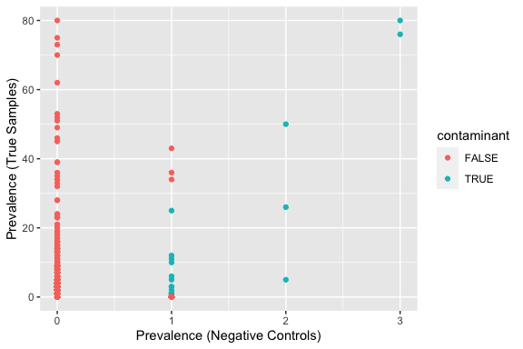<!-- -->

``` r
# 16S

kit.16s <- subset_samples(ps.16s_OP_nz, Type != "PCR Negative")
kit.16s <- subset_samples(kit.16s, Type != "Mock Community")

contams.16s <- run_decontam_threshold(kit.16s, 0.5, "Negative Control")

# number of contaminants
length(contams.16s[[1]])
```

    ## [1] 193

``` r
# plot
contams.16s[[2]]
```

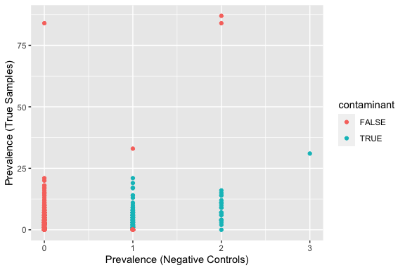<!-- -->

``` r
# those 2 present at high levels in 2 kit controls are the
# symbionts, so some spillover of true 16S
```

``` r
# ITS

# first remove other controls
pcr.its <- subset_samples(ps.its_nz, Type != "Negative Control")
pcr.its <- subset_samples(pcr.its, Type != "Mock Community")

contams.its.pcr <- run_decontam_threshold(pcr.its, 0.5, "PCR Negative")

# number of contaminants
length(contams.its.pcr[[1]])
```

    ## [1] 21

``` r
# plot
contams.its.pcr[[2]]
```

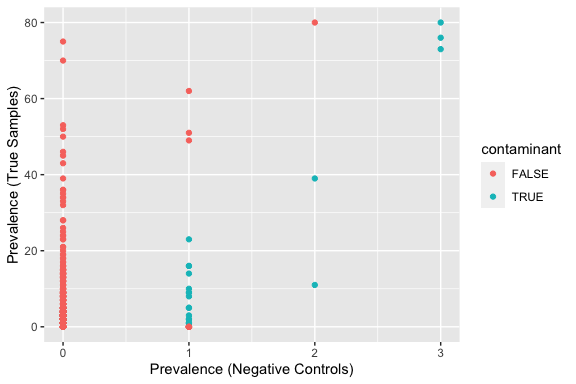<!-- -->

``` r
# 16S

pcr.16s <- subset_samples(ps.16s_OP_nz, Type != "Negative Control")
pcr.16s <- subset_samples(pcr.16s, Type != "Mock Community")

contams.16s.pcr <- run_decontam_threshold(pcr.16s, 0.5, "PCR Negative")

# number of contaminants
length(contams.16s.pcr[[1]])
```

    ## [1] 242

``` r
# plot
contams.16s.pcr[[2]]
```

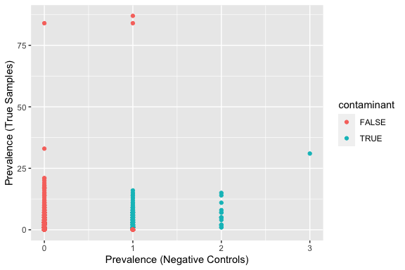<!-- -->

``` r
# ITS

# remove contaminant ASVs
all_contams.its <- unique(append(contams.its[[1]], contams.its.pcr[[1]]))

all_taxa.its <- taxa_names(ps.its_nz)
newtaxa.its <- all_taxa.its[!(all_taxa.its %in% all_contams.its)]

# total num contams
length(unique(all_contams.its))
```

    ## [1] 36

``` r
ps.its_decontam <- prune_taxa(newtaxa.its, ps.its_nz)

# remove control samples
ps.its_decontam_NC <- subset_samples(ps.its_decontam, Type !=
    "Mock Community")
ps.its_decontam_NC <- subset_samples(ps.its_decontam_NC, Type !=
    "PCR Negative")
ps.its_decontam_NC <- subset_samples(ps.its_decontam_NC, Type !=
    "Negative Control")

ps.its_decontam_NC
```

    ## phyloseq-class experiment-level object
    ## otu_table()   OTU Table:         [ 1812 taxa and 86 samples ]
    ## sample_data() Sample Data:       [ 86 samples by 28 sample variables ]
    ## tax_table()   Taxonomy Table:    [ 1812 taxa by 7 taxonomic ranks ]

``` r
# remove contaminant ASVs remove contaminant ASVs
all_contams.16s <- unique(append(contams.16s[[1]], contams.16s.pcr[[1]]))

all_taxa.16s <- taxa_names(ps.16s_OP_nz)
newtaxa.16s <- all_taxa.16s[!(all_taxa.16s %in% all_contams.16s)]

# total num contams
length(unique(all_contams.16s))
```

    ## [1] 318

``` r
ps.16s_decontam <- prune_taxa(newtaxa.16s, ps.16s_OP_nz)

# remove control samples
ps.16s_decontam_NC <- subset_samples(ps.16s_decontam, Type !=
    "Mock Community")
ps.16s_decontam_NC <- subset_samples(ps.16s_decontam_NC, Type !=
    "PCR Negative")
ps.16s_decontam_NC <- subset_samples(ps.16s_decontam_NC, Type !=
    "Negative Control")

ps.16s_decontam_NC
```

    ## phyloseq-class experiment-level object
    ## otu_table()   OTU Table:         [ 2971 taxa and 87 samples ]
    ## sample_data() Sample Data:       [ 87 samples by 28 sample variables ]
    ## tax_table()   Taxonomy Table:    [ 2971 taxa by 7 taxonomic ranks ]

### Assessing rarefaction curves & library size

``` r
# ITS

# plotting rarefaction curves, using step = 1000 reads
p = ggrare(ps.its_decontam_NC, step = 100, label = "SampleID",
    color = "Wild.Captive")
```

<!-- -->

``` r
# drawing cut-off line at 5000 reads
p + geom_vline(xintercept = 5000, linetype = "dashed")
```

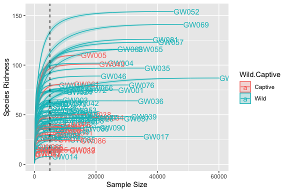<!-- -->

``` r
## Look at library size
df <- as.data.frame(sample_data(ps.its_decontam_NC))  # Put sample_data into a ggplot-friendly data.frame
df$LibrarySize <- sample_sums(ps.its_decontam_NC)
df <- df[order(df$LibrarySize), ]
df$Index <- seq(nrow(df))

# plot library size with line at 1000 reads
ggplot(data = df, aes(x = Index, y = LibrarySize, color = Wild.Captive)) +
    geom_point() + geom_hline(yintercept = 1000, linetype = "dashed") +
    theme(text = element_text(size = 18))
```

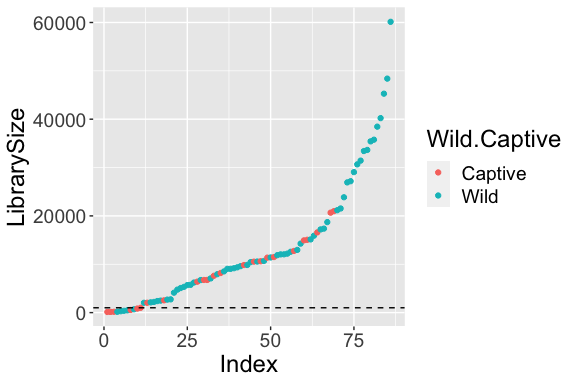<!-- -->

``` r
summary(df$LibrarySize)
```

    ##    Min. 1st Qu.  Median    Mean 3rd Qu.    Max. 
    ##     136    4830   10148   13230   17051   60139

``` r
# Given that median is 10000, first qu. is ~4800, nice
# breaks around ~2000 or 4000 reads
hist(df$LibrarySize, breaks = 50)  #right skewed 
```

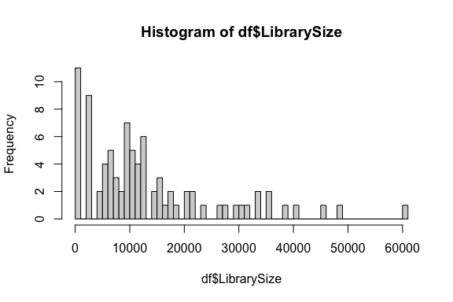<!-- -->

``` r
# which samples do we lose?
as_tibble(df) %>%
    filter(LibrarySize < 2000) %>%
    group_by(Location, Rel.Res, Wild.Captive) %>%
    tally()  #lose a lot of captive sus
```

    ## # A tibble: 7 × 4
    ## # Groups:   Location, Rel.Res [7]
    ##   Location               Rel.Res       Wild.Captive     n
    ##   <chr>                  <chr>         <chr>        <int>
    ## 1 Edison Kern County     ""            Wild             1
    ## 2 Greenhouse             ""            Captive          1
    ## 3 Greenhouse             "Resistant"   Captive          1
    ## 4 Greenhouse             "Susceptible" Captive          4
    ## 5 Temecula               "Susceptible" Wild             1
    ## 6 Tulare (SUS)           "Susceptible" Wild             1
    ## 7 Urban Site Kern County "Susceptible" Wild             2

``` r
# log10(1) = 0, log10(10) = 1, log10(100) = 2, log10(1000)
# = 3, so rarefy at 1000 line would be:
ggplot(data = df, aes(x = log10(LibrarySize), fill = Wild.Captive)) +
    geom_histogram(binwidth = 1, position = "dodge", col = "black") +
    theme(text = element_text(size = 18)) + ylab("Frequency of samples") +
    xlab(expression(paste("lo", g[10], " transformed read counts"))) +
    scale_x_continuous(breaks = c(0, 1, 2, 3, 4, 5)) + geom_vline(xintercept = 3.5,
    linetype = "solid", col = "#EF7F4FFF", size = 2)
```

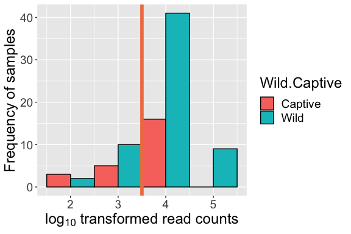<!-- -->

``` r
# 16S

# plotting rarefaction curves, using step = 1000 reads
p = ggrare(ps.16s_decontam_NC, step = 100, label = "SampleID",
    color = "Wild.Captive")
```

<!-- -->

``` r
# drawing cut-off line at 5000 reads
p + geom_vline(xintercept = 5000, linetype = "dashed")
```

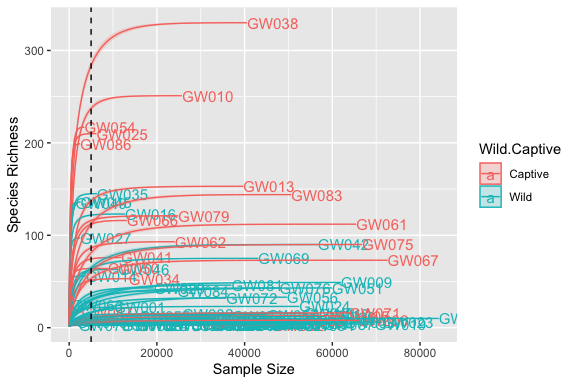<!-- -->

``` r
## Look at library size
df <- as.data.frame(sample_data(ps.16s_decontam_NC))  # Put sample_data into a ggplot-friendly data.frame
df$LibrarySize <- sample_sums(ps.16s_decontam_NC)
df <- df[order(df$LibrarySize), ]
df$Index <- seq(nrow(df))

# plot library size with line at 1000 reads
ggplot(data = df, aes(x = Index, y = LibrarySize, color = Wild.Captive)) +
    geom_point() + geom_hline(yintercept = 5000, linetype = "dashed") +
    theme(text = element_text(size = 18))
```

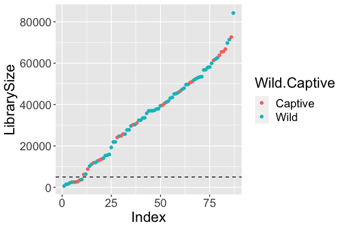<!-- -->

``` r
summary(df$LibrarySize)
```

    ##    Min. 1st Qu.  Median    Mean 3rd Qu.    Max. 
    ##     630   15452   36936   34656   50843   84250

``` r
# Given that median is 36000, first qu. is ~15000, nice
# breaks around 5000 reads
hist(df$LibrarySize, breaks = 50)  #right skewed slightly
```

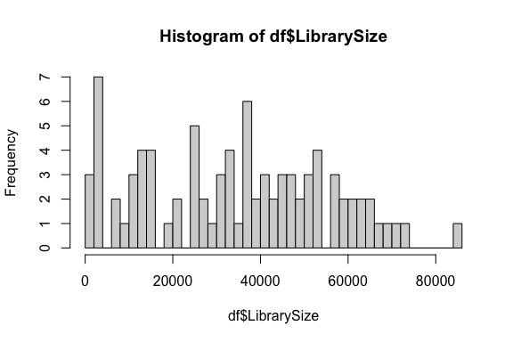<!-- -->

``` r
# which samples do we lose?
as_tibble(df) %>%
    filter(LibrarySize < 6000) %>%
    group_by(Location, Rel.Res, Wild.Captive) %>%
    tally()  #lose a lot of captive sus
```

    ## # A tibble: 4 × 4
    ## # Groups:   Location, Rel.Res [4]
    ##   Location                  Rel.Res     Wild.Captive     n
    ##   <chr>                     <chr>       <chr>        <int>
    ## 1 General Beale Kern County Resistant   Wild             2
    ## 2 Greenhouse                Susceptible Captive          3
    ## 3 Tulare (RES)              Resistant   Wild             1
    ## 4 Urban Site Kern County    Susceptible Wild             4

``` r
# log10(1) = 0, log10(10) = 1, log10(100) = 2, log10(1000)
# = 3, so rarefy at 1000 line would be:
ggplot(data = df, aes(x = log10(LibrarySize), fill = Wild.Captive)) +
    geom_histogram(binwidth = 1, position = "dodge", col = "black") +
    theme(text = element_text(size = 18)) + ylab("Frequency of samples") +
    xlab(expression(paste("lo", g[10], " transformed read counts"))) +
    scale_x_continuous(breaks = c(0, 1, 2, 3, 4, 5)) + geom_vline(xintercept = 3.5,
    linetype = "solid", col = "#EF7F4FFF", size = 2)
```

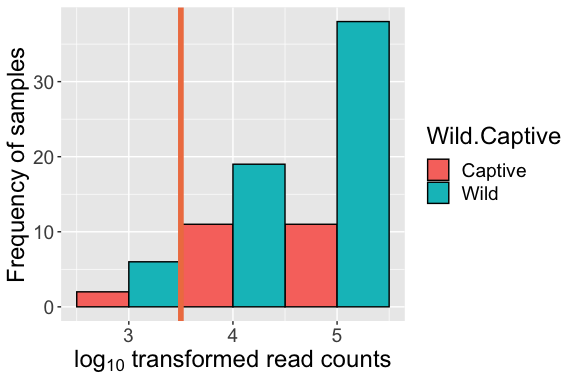<!-- -->

## Subsetting Data

``` r
# first subset to remove samples not important to our
# questions
rare_num_its = 2000
rare_num_16s = 6000


# ITS

# first subset samples for comparative Qs, then rarefy for
# alpha div qs (will use avgdist for beta div)

ps.its_decontam_NC_wild <- subset_samples(ps.its_decontam_NC,
    Wild.Captive != "Captive")  #use only wild for biogeography

ps.its_decontam_NC_wild.captive <- ps.its_decontam_NC  #use whole dataset for wild vs. captive

ps.its_decontam_NC_wild.captive.lines <- subset_samples(ps.its_decontam_NC,
    WC == "RES" | WC == "SUS")  #use only res & sus for questions on line questions

ps.its_decontam_NC_captive.res <- subset_samples(ps.its_decontam_NC,
    Wild.Captive == "Captive" & (WC == "RES" | WC == "SUS"))  #use only res & sus for questions on captive line x resistance

ps.its_decontam_NC_wild.res <- subset_samples(ps.its_decontam_NC,
    Wild.Captive != "Captive" & Rel.Res != "")  #use only res & sus for questions on wild x resistance

# rarefied versions

ps.its_decontam_NC_wild_rare <- rarefy_even_depth(ps.its_decontam_NC_wild,
    sample.size = rare_num_its, rngseed = 5311, replace = FALSE)  #5 samples removed
```

    ## `set.seed(5311)` was used to initialize repeatable random subsampling.

    ## Please record this for your records so others can reproduce.

    ## Try `set.seed(5311); .Random.seed` for the full vector

    ## ...

    ## 5 samples removedbecause they contained fewer reads than `sample.size`.

    ## Up to first five removed samples are:

    ## GW002GW009GW016GW027GW088

    ## ...

    ## 650OTUs were removed because they are no longer 
    ## present in any sample after random subsampling

    ## ...

``` r
ps.its_decontam_NC_wild.captive_rare <- rarefy_even_depth(ps.its_decontam_NC_wild.captive,
    sample.size = rare_num_its, rngseed = 5311, replace = FALSE)  #11 samples removed
```

    ## `set.seed(5311)` was used to initialize repeatable random subsampling.

    ## Please record this for your records so others can reproduce.

    ## Try `set.seed(5311); .Random.seed` for the full vector

    ## ...

    ## 11 samples removedbecause they contained fewer reads than `sample.size`.

    ## Up to first five removed samples are:

    ## GW002GW006GW009GW013GW016

    ## ...

    ## 366OTUs were removed because they are no longer 
    ## present in any sample after random subsampling

    ## ...

``` r
ps.its_decontam_NC_wild.captive.lines_rare <- rarefy_even_depth(ps.its_decontam_NC_wild.captive.lines,
    sample.size = rare_num_its, rngseed = 5311, replace = FALSE)  #6 samples removed
```

    ## `set.seed(5311)` was used to initialize repeatable random subsampling.

    ## Please record this for your records so others can reproduce.

    ## Try `set.seed(5311); .Random.seed` for the full vector

    ## ...

    ## 6 samples removedbecause they contained fewer reads than `sample.size`.

    ## Up to first five removed samples are:

    ## GW009GW013GW027GW062GW066

    ## ...

    ## 1305OTUs were removed because they are no longer 
    ## present in any sample after random subsampling

    ## ...

``` r
ps.its_decontam_NC_captive.res_rare <- rarefy_even_depth(ps.its_decontam_NC_captive.res,
    sample.size = rare_num_its, rngseed = 5311, replace = FALSE)  #4 samples removed
```

    ## `set.seed(5311)` was used to initialize repeatable random subsampling.

    ## Please record this for your records so others can reproduce.

    ## Try `set.seed(5311); .Random.seed` for the full vector

    ## ...

    ## 4 samples removedbecause they contained fewer reads than `sample.size`.

    ## Up to first five removed samples are:

    ## GW013GW062GW066GW067

    ## ...

    ## 1597OTUs were removed because they are no longer 
    ## present in any sample after random subsampling

    ## ...

``` r
ps.its_decontam_NC_wild.res_rare <- rarefy_even_depth(ps.its_decontam_NC_wild.res,
    sample.size = rare_num_its, rngseed = 5311, replace = FALSE)  #4 samples removed
```

    ## `set.seed(5311)` was used to initialize repeatable random subsampling.

    ## Please record this for your records so others can reproduce.

    ## Try `set.seed(5311); .Random.seed` for the full vector

    ## ...

    ## 4 samples removedbecause they contained fewer reads than `sample.size`.

    ## Up to first five removed samples are:

    ## GW002GW009GW016GW027

    ## ...

    ## 1029OTUs were removed because they are no longer 
    ## present in any sample after random subsampling

    ## ...

``` r
# 16S

ps.16s_decontam_NC_wild <- subset_samples(ps.16s_decontam_NC,
    Wild.Captive != "Captive")  #use only wild for biogeography

ps.16s_decontam_NC_wild.captive <- ps.16s_decontam_NC  #use whole dataset for wild vs. captive

ps.16s_decontam_NC_wild.captive.lines <- subset_samples(ps.16s_decontam_NC,
    WC == "RES" | WC == "SUS")  #use only res & sus for questions on line questions

ps.16s_decontam_NC_captive.res <- subset_samples(ps.16s_decontam_NC,
    Wild.Captive == "Captive" & (WC == "RES" | WC == "SUS"))  #use only res & sus for questions on captive line x resistance

ps.16s_decontam_NC_wild.res <- subset_samples(ps.16s_decontam_NC,
    Wild.Captive != "Captive" & Rel.Res != "")  #use only res & sus for questions on wild x resistance

# rarefied versions

ps.16s_decontam_NC_wild_rare <- rarefy_even_depth(ps.16s_decontam_NC_wild,
    sample.size = rare_num_16s, rngseed = 5311, replace = FALSE)  #7 samples removed
```

    ## `set.seed(5311)` was used to initialize repeatable random subsampling.

    ## Please record this for your records so others can reproduce.

    ## Try `set.seed(5311); .Random.seed` for the full vector

    ## ...

    ## 7 samples removedbecause they contained fewer reads than `sample.size`.

    ## Up to first five removed samples are:

    ## GW014GW027GW045GW049GW063

    ## ...

    ## 2392OTUs were removed because they are no longer 
    ## present in any sample after random subsampling

    ## ...

``` r
ps.16s_decontam_NC_wild.captive_rare <- rarefy_even_depth(ps.16s_decontam_NC_wild.captive,
    sample.size = rare_num_16s, rngseed = 5311, replace = FALSE)  #10 samples removed
```

    ## `set.seed(5311)` was used to initialize repeatable random subsampling.

    ## Please record this for your records so others can reproduce.

    ## Try `set.seed(5311); .Random.seed` for the full vector

    ## ...

    ## 10 samples removedbecause they contained fewer reads than `sample.size`.

    ## Up to first five removed samples are:

    ## GW014GW027GW045GW047GW049

    ## ...

    ## 1402OTUs were removed because they are no longer 
    ## present in any sample after random subsampling

    ## ...

``` r
ps.16s_decontam_NC_wild.captive.lines_rare <- rarefy_even_depth(ps.16s_decontam_NC_wild.captive.lines,
    sample.size = rare_num_16s, rngseed = 5311, replace = FALSE)  #7 samples removed
```

    ## `set.seed(5311)` was used to initialize repeatable random subsampling.

    ## Please record this for your records so others can reproduce.

    ## Try `set.seed(5311); .Random.seed` for the full vector

    ## ...

    ## 7 samples removedbecause they contained fewer reads than `sample.size`.

    ## Up to first five removed samples are:

    ## GW014GW027GW045GW049GW063

    ## ...

    ## 1934OTUs were removed because they are no longer 
    ## present in any sample after random subsampling

    ## ...

``` r
ps.16s_decontam_NC_captive.res_rare <- rarefy_even_depth(ps.16s_decontam_NC_captive.res,
    sample.size = rare_num_16s, rngseed = 5311, replace = FALSE)  #1 samples removed
```

    ## `set.seed(5311)` was used to initialize repeatable random subsampling.

    ## Please record this for your records so others can reproduce.

    ## Try `set.seed(5311); .Random.seed` for the full vector

    ## ...

    ## 1 samples removedbecause they contained fewer reads than `sample.size`.

    ## Up to first five removed samples are:

    ## GW086

    ## ...

    ## 2103OTUs were removed because they are no longer 
    ## present in any sample after random subsampling

    ## ...

``` r
ps.16s_decontam_NC_wild.res_rare <- rarefy_even_depth(ps.16s_decontam_NC_wild.res,
    sample.size = rare_num_16s, rngseed = 5311, replace = FALSE)  #7 samples removed
```

    ## `set.seed(5311)` was used to initialize repeatable random subsampling.

    ## Please record this for your records so others can reproduce.

    ## Try `set.seed(5311); .Random.seed` for the full vector

    ## ...

    ## 7 samples removedbecause they contained fewer reads than `sample.size`.

    ## Up to first five removed samples are:

    ## GW014GW027GW045GW049GW063

    ## ...

    ## 2508OTUs were removed because they are no longer 
    ## present in any sample after random subsampling

    ## ...

``` r
alpha_pvals <- data.frame()
adonis_pvals <- data.frame()
disp_pvals <- data.frame()
```

## Alpha Diversity

### Overall (all GWSS, 16s vs ITS)

``` r
alpha.its.over <- test_alpha_div(ps.its_decontam_NC_wild.captive_rare,
    "Wild.Captive", "Shannon")
alpha.16s.over <- test_alpha_div(ps.16s_decontam_NC_wild.captive_rare,
    "Wild.Captive", "Shannon")

alpha.its.over[[3]]$Seq = "ITS"
alpha.16s.over[[3]]$Seq = "16S"

combined.alpha.over <- full_join(alpha.its.over[[3]], alpha.16s.over[[3]])
```

    ## Joining with `by = join_by(Shannon, SampleID, Type, Resistance.Status, Rel.Res,
    ## Location.2, Location, Original.Location, Loc.Abbr, WC, Year, Wild.Captive,
    ## Source, Original.Tube.Name, Sex, Date, Line, Extraction.Block, Extraction.Date,
    ## Extracted.By, Well, X16S.Primer.Plate, X16S.Sequence.Name, X16S.Sequence,
    ## X16S.Barcode, ITS.Sequence.Name, ITS.Sequence, ITS.Barcode, ITS.Primer.plate,
    ## Seq)`

``` r
combined.alpha.over$Seq = as.factor(combined.alpha.over$Seq)

result.alpha.over <- kruskal_test(Shannon ~ Seq, distribution = approximate(nresample = 9999),
    data = combined.alpha.over)

alpha.over <- data.frame(Data = c("ITS vs. 16S"), Samples = "all GWSS",
    Diversity = "Alpha", Metric = "Shannon", Category = "Amplicon",
    pval = c(pvalue(result.alpha.over)[1]))

alpha_pvals <- bind_rows(alpha.over, alpha_pvals)
```

### Biogeography (wild GWSS)

Populations - no signficant differences in alpha diversity

``` r
alpha.its.loc <- test_alpha_div(ps.its_decontam_NC_wild_rare,
    "Location", "Shannon")  #returns KW results, Dunn test posthoc, alpha estimates 

# alpha.its.loc[[1]] #not sig

alpha.16s.loc <- test_alpha_div(ps.16s_decontam_NC_wild_rare,
    "Location", "Shannon")

# alpha.16s.loc[[1]] #not sig

alpha.loc <- data.frame(Data = c("ITS", "16S"), Samples = "wild GWSS",
    Diversity = "Alpha", Metric = "Shannon", Category = "Population",
    pval = c(pvalue(alpha.its.loc[[1]])[1], pvalue(alpha.16s.loc[[1]])[1]))

alpha_pvals <- bind_rows(alpha.loc, alpha_pvals)
```

Regions - no signficant differences in alpha diversity

``` r
alpha.its.loc.reg <- test_alpha_div(ps.its_decontam_NC_wild_rare,
    "Loc.Abbr", "Shannon")  #returns KW results, Dunn test posthoc, alpha estimates 

# alpha.its.loc.reg[[1]] #not sig

alpha.16s.loc.reg <- test_alpha_div(ps.16s_decontam_NC_wild_rare,
    "Loc.Abbr", "Shannon")

# alpha.16s.loc.reg[[1]] #not sig

alpha.loc.reg <- data.frame(Data = c("ITS", "16S"), Samples = "wild GWSS",
    Diversity = "Alpha", Metric = "Shannon", Category = "Region",
    pval = c(pvalue(alpha.its.loc.reg[[1]])[1], pvalue(alpha.16s.loc.reg[[1]])[1]))

alpha_pvals <- bind_rows(alpha.loc.reg, alpha_pvals)
```

### Captivity (all GWSS)

Alpha diversity significantly different for 16S data, possibly due
samples with rare taxa, no difference for ITS.

``` r
alpha.its.capt <- test_alpha_div(ps.its_decontam_NC_wild.captive_rare,
    "Wild.Captive", "Shannon")

# alpha.its.capt[[1]] #not sig

alpha.16s.capt <- test_alpha_div(ps.16s_decontam_NC_wild.captive_rare,
    "Wild.Captive", "Shannon")

# alpha.16s.capt[[1]] #sig

alpha.capt <- data.frame(Data = c("ITS", "16S"), Samples = "all GWSS",
    Diversity = "Alpha", Metric = "Shannon", Category = "Captivity",
    pval = c(pvalue(alpha.its.capt[[1]])[1], pvalue(alpha.16s.capt[[1]])[1]))

alpha_pvals <- bind_rows(alpha.capt, alpha_pvals)
```

### Sex (all GWSS)

No significant differences.

``` r
alpha.its.sex <- test_alpha_div(ps.its_decontam_NC_wild.captive_rare,
    "Sex", "Shannon")

# alpha.its.sex[[1]] #not sig

alpha.16s.sex <- test_alpha_div(ps.16s_decontam_NC_wild.captive_rare,
    "Sex", "Shannon")

# alpha.16s.sex[[1]] #not sig


alpha.sex <- data.frame(Data = c("ITS", "16S"), Samples = "all GWSS",
    Diversity = "Alpha", Metric = "Shannon", Category = "Sex",
    pval = c(pvalue(alpha.its.sex[[1]])[1], pvalue(alpha.16s.sex[[1]])[1]))

alpha_pvals <- bind_rows(alpha.sex, alpha_pvals)
```

### Resistance (wild GWSS)

No significant differences.

``` r
alpha.its.res.wild <- test_alpha_div(ps.its_decontam_NC_wild.res_rare,
    "Rel.Res", "Shannon")  #returns KW results, Dunn test posthoc, alpha estimates 

# alpha.its.res.wild[[1]] #not sig

alpha.16s.res.wild <- test_alpha_div(ps.16s_decontam_NC_wild.res_rare,
    "Rel.Res", "Shannon")

# alpha.16s.res.wild[[1]] #not sig

alpha.resW <- data.frame(Data = c("ITS", "16S"), Samples = "wild GWSS",
    Diversity = "Alpha", Metric = "Shannon", Category = "Resistance",
    pval = c(pvalue(alpha.its.res.wild[[1]])[1], pvalue(alpha.16s.res.wild[[1]])[1]))

alpha_pvals <- bind_rows(alpha.resW, alpha_pvals) %>%
    group_by(Data) %>%
    mutate(padj = p.adjust(pval, method = "BH"))

write.csv(alpha_pvals, "../results/alpha_pvals.csv")
```

## Plotting Alpha Diversity

### Biogeography (wild GWSS)

Population-level

``` r
# ITS

plot.alpha.its.loc <- alpha.its.loc[[3]] %>%
    mutate(Location.2 = factor(Location.2, levels = c("San Diego",
        "Temecula", "Riverside", "Ventura", "General Beale Kern County",
        "Edison Kern County", "Urban Site Kern County", "Tulare (RES)",
        "Tulare (SUS)"), labels = c("San Diego", "Temecula",
        "Riverside", "Ventura", "Kern County (General Beale)",
        "Kern County (Edison)", "Kern County (Urban Site)", "Tulare (RES)",
        "Tulare (SUS)"))) %>%
    group_by(Location.2) %>%
    summarise(mean_S = mean(Shannon), sd_S = sd(Shannon), se_S = se(Shannon)) %>%
    ggplot(aes(x = Location.2, y = (mean_S), fill = Location.2)) +
    geom_bar(stat = "identity", position = position_dodge()) +
    geom_errorbar(aes(ymin = (mean_S - se_S), ymax = (mean_S +
        se_S)), width = 0.4, position = position_dodge(0.9)) +
    theme(axis.text.x = element_text(angle = -70, hjust = 0,
        vjust = 0.5)) + ylab("Mean Shannon Diversity") + theme(text = element_text(size = 20)) +
    theme(legend.position = "none") + labs(x = "") + scale_fill_manual(values = c("#440154FF",
    "#46337EFF", "#365C8DFF", "#277F8EFF", "#1FA187FF", "#4AC16DFF",
    "#9FDA3AFF", "#FDE725FF", "#ffd14e", "#e69f00", "#ffa54e",
    "#ffb083", "#ffc1b5")) + labs(color = "Location", shape = "Captivity")

# 16S
plot.alpha.16s.loc <- alpha.16s.loc[[3]] %>%
    mutate(Location.2 = factor(Location.2, levels = c("San Diego",
        "Temecula", "Riverside", "Ventura", "General Beale Kern County",
        "Edison Kern County", "Urban Site Kern County", "Tulare (RES)",
        "Tulare (SUS)"), labels = c("San Diego", "Temecula",
        "Riverside", "Ventura", "Kern County (General Beale)",
        "Kern County (Edison)", "Kern County (Urban Site)", "Tulare (RES)",
        "Tulare (SUS)"))) %>%
    group_by(Location.2) %>%
    summarise(mean_S = mean(Shannon), sd_S = sd(Shannon), se_S = se(Shannon)) %>%
    ggplot(aes(x = Location.2, y = (mean_S), fill = Location.2)) +
    geom_bar(stat = "identity", position = position_dodge()) +
    geom_errorbar(aes(ymin = (mean_S - se_S), ymax = (mean_S +
        se_S)), width = 0.4, position = position_dodge(0.9)) +
    theme(axis.text.x = element_text(angle = -70, hjust = 0,
        vjust = 0.5)) + ylab("Mean Shannon Diversity") + theme(text = element_text(size = 20)) +
    theme(legend.position = "none") + scale_fill_manual(values = c("#440154FF",
    "#46337EFF", "#365C8DFF", "#277F8EFF", "#1FA187FF", "#4AC16DFF",
    "#9FDA3AFF", "#FDE725FF", "#ffd14e", "#e69f00", "#ffa54e",
    "#ffb083", "#ffc1b5")) + labs(x = "")


# Combined
plot.alpha.its.loc/plot.alpha.16s.loc + plot_annotation(tag_levels = "A")
```

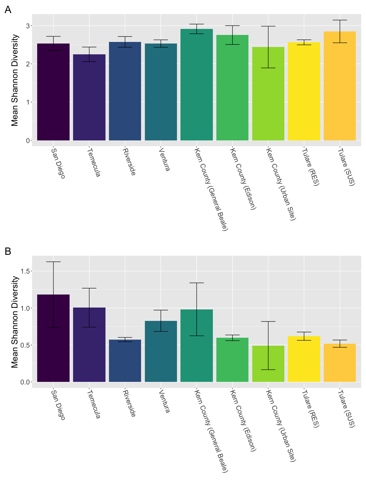<!-- -->

``` r
ggsave("../plots/alpha_location.png", dpi = 300, device = "png",
    height = 16, width = 12, units = "in")
ggsave("../plots/alpha_location.pdf", dpi = 300, device = "pdf",
    height = 16, width = 12, units = "in")
```

### Captivity (all GWSS)

``` r
# ITS

plot.alpha.its.capt <- alpha.its.capt[[3]] %>%
    group_by(Wild.Captive) %>%
    summarise(mean_S = mean(Shannon), sd_S = sd(Shannon), se_S = se(Shannon)) %>%
    ggplot(aes(x = Wild.Captive, y = (mean_S), fill = Wild.Captive)) +
    geom_bar(stat = "identity", position = position_dodge()) +
    geom_errorbar(aes(ymin = (mean_S - se_S), ymax = (mean_S +
        se_S)), width = 0.4, position = position_dodge(0.9)) +
    theme(axis.text.x = element_text(angle = -70, hjust = 0,
        vjust = 0.5)) + ylab("Mean Shannon Diversity") + theme(text = element_text(size = 20)) +
    theme(legend.position = "none") + scale_fill_manual(values = c("#E69F00",
    "#0072B2")) + geom_text(aes(x = Wild.Captive, label = c("a",
    "a"), y = (mean_S + se_S), size = 8, vjust = -0.7), col = "black",
    show.legend = F) + ylim(NA, 3) + labs(x = "")

# 16S
plot.alpha.16s.capt <- alpha.16s.capt[[3]] %>%
    group_by(Wild.Captive) %>%
    summarise(mean_S = mean(Shannon), sd_S = sd(Shannon), se_S = se(Shannon)) %>%
    ggplot(aes(x = Wild.Captive, y = (mean_S), fill = Wild.Captive)) +
    geom_bar(stat = "identity", position = position_dodge()) +
    geom_errorbar(aes(ymin = (mean_S - se_S), ymax = (mean_S +
        se_S)), width = 0.4, position = position_dodge(0.9)) +
    theme(axis.text.x = element_text(angle = -70, hjust = 0,
        vjust = 0.5)) + ylab("Mean Shannon Diversity") + theme(text = element_text(size = 20)) +
    theme(legend.position = "none") + scale_fill_manual(values = c("#E69F00",
    "#0072B2")) + geom_text(aes(x = Wild.Captive, label = c("a",
    "a"), y = (mean_S + se_S), size = 8, vjust = -0.7), col = "black",
    show.legend = F) + ylim(NA, 3) + labs(x = "")


# Combined
plot.alpha.its.capt + plot.alpha.16s.capt + plot_annotation(tag_levels = "A")
```

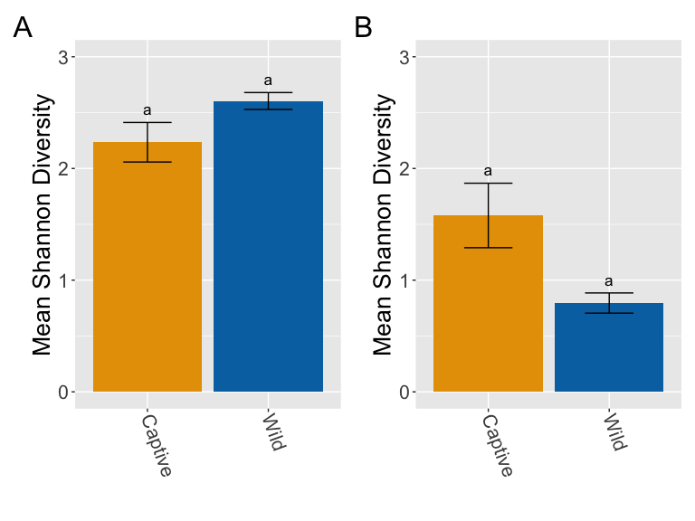<!-- -->

``` r
ggsave("../plots/alpha_captive.png", dpi = 300, device = "png",
    height = 6, width = 8, units = "in")
ggsave("../plots/alpha_captive.pdf", dpi = 300, device = "pdf",
    height = 6, width = 8, units = "in")
```

### Resistance (wild, captive GWSS)

``` r
# ITS

plot.alpha.its.res <- alpha.its.res.wild[[3]] %>%
    group_by(Wild.Captive, Rel.Res) %>%
    summarise(mean_S = mean(Shannon), sd_S = sd(Shannon), se_S = se(Shannon)) %>%
    ggplot(aes(x = Rel.Res, y = (mean_S), fill = Rel.Res)) +
    geom_bar(stat = "identity", position = position_dodge()) +
    geom_errorbar(aes(ymin = (mean_S - se_S), ymax = (mean_S +
        se_S)), width = 0.4, position = position_dodge(0.9)) +
    theme(axis.text.x = element_text(angle = -70, hjust = 0,
        vjust = 0.5)) + ylab("Mean Shannon Diversity") + theme(text = element_text(size = 20)) +
    theme(legend.position = "none") + scale_fill_manual(values = c("#440154FF",
    "#FDE725FF")) + geom_text(aes(x = Rel.Res, label = c("a",
    "a"), y = (mean_S + se_S), size = 8, vjust = -0.7), col = "black",
    show.legend = F) + ylim(NA, 3.25) + labs(x = "")
```

    ## `summarise()` has grouped output by 'Wild.Captive'. You can override using the
    ## `.groups` argument.

``` r
# 16S
plot.alpha.16s.res <- alpha.16s.res.wild[[3]] %>%
    group_by(Wild.Captive, Rel.Res) %>%
    summarise(mean_S = mean(Shannon), sd_S = sd(Shannon), se_S = se(Shannon)) %>%
    ggplot(aes(x = Rel.Res, y = (mean_S), fill = Rel.Res)) +
    geom_bar(stat = "identity", position = position_dodge()) +
    geom_errorbar(aes(ymin = (mean_S - se_S), ymax = (mean_S +
        se_S)), width = 0.4, position = position_dodge(0.9)) +
    theme(axis.text.x = element_text(angle = -70, hjust = 0,
        vjust = 0.5)) + ylab("Mean Shannon Diversity") + theme(text = element_text(size = 20)) +
    theme(legend.position = "none") + scale_fill_manual(values = c("#440154FF",
    "#FDE725FF")) + geom_text(aes(x = Rel.Res, label = c("a",
    "a"), y = (mean_S + se_S), size = 8, vjust = -0.7), col = "black",
    show.legend = F) + ylim(NA, 3.25) + labs(x = "")
```

    ## `summarise()` has grouped output by 'Wild.Captive'. You can override using the
    ## `.groups` argument.

``` r
# Combined
plot.alpha.its.res + plot.alpha.16s.res + plot_annotation(tag_levels = "A")
```

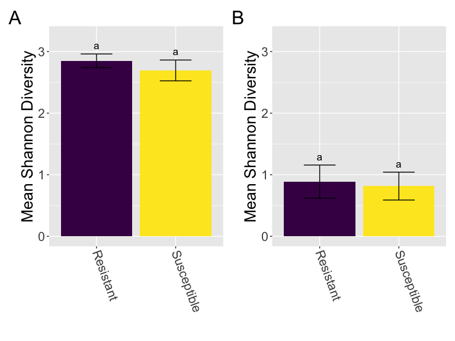<!-- -->

``` r
ggsave("../plots/alpha_res.png", dpi = 300, device = "png", height = 6,
    width = 8, units = "in")
ggsave("../plots/alpha_res.pdf", dpi = 300, device = "pdf", height = 6,
    width = 8, units = "in")
```

## Beta Diversity

### Biogeography (wild GWSS)

Location matters, Year matters

``` r
# ITS

beta.its.loc <- calculate_beta_div(ps.its_decontam_NC_wild, "hellinger",
    rare_num_its, "PCoA")
```

    ## Warning in avgdist(as.data.frame(beta_div_df@otu_table), sample = rare, : most
    ## observed count data have counts 1, but smallest count is 2

    ## Warning in avgdist(as.data.frame(beta_div_df@otu_table), sample = rare, : The
    ## following sampling units were removed because they were below sampling depth:
    ## GW002, GW009, GW016, GW027, GW088

``` r
ps.its_decontam_NC_wild.sub <- subset_samples(ps.its_decontam_NC_wild,
    SampleID %in% rownames(as.data.frame(as.matrix(beta.its.loc[[2]]))))

# using ordistep to assess best model paramaters dbRDA
# (capscale)
upr <- capscale(beta.its.loc[[2]] ~ ., data = select(as(sample_data(ps.its_decontam_NC_wild.sub),
    "data.frame"), "Location", "Sex", "Year"))  #not including resistance because not all samples have this info
lwr <- capscale(beta.its.loc[[2]] ~ 1, data = as(sample_data(ps.its_decontam_NC_wild.sub),
    "data.frame"))

model <- ordiR2step(lwr, upr, trace = 0)  #location best model

# adonis tests for differences in centroid and/or
# dispersion final model is both year and location since
# there is an interaction and for 16S year important and
# want consistent models
beta.its.loc.res <- adonis2(beta.its.loc[[2]] ~ Location + Year,
    as(sample_data(ps.its_decontam_NC_wild.sub), "data.frame"),
    permutations = 9999, by = "margin")  #sig

# beta.its.loc.res

beta.its.loc.pvals <- get_beta_pvals(beta.its.loc.res, 2)

# no posthoc adonis test so need to do pair-wise
pw.beta.its.loc <- pairwise.adonis(beta.its.loc[[2]], as.factor(as(sample_data(ps.its_decontam_NC_wild.sub),
    "data.frame")[, "Location"]), perm = 9999, p.adjust.m = "BH")
```

    ## 'nperm' >= set of all permutations: complete enumeration.

    ## Set of permutations < 'minperm'. Generating entire set.

    ## 'nperm' >= set of all permutations: complete enumeration.

    ## Set of permutations < 'minperm'. Generating entire set.

    ## 'nperm' >= set of all permutations: complete enumeration.

    ## Set of permutations < 'minperm'. Generating entire set.

``` r
write.csv(pw.beta.its.loc, "../results/ITS/pw_beta_location.csv")

# convert to matrix for possib supp table
pw.beta.its.loc.pretty <- pw.beta.its.loc %>%
    separate(pairs, c("pair1", "pair2"), sep = " vs ") %>%
    select(pair1, pair2, p.adjusted) %>%
    pivot_wider(names_from = pair2, values_from = p.adjusted)

write.csv(pw.beta.its.loc.pretty, "../results/ITS/pw_beta_loc_tab.csv")

# region
beta.its.reg.res <- adonis2(beta.its.loc[[2]] ~ Loc.Abbr + Year,
    as(sample_data(ps.its_decontam_NC_wild.sub), "data.frame"),
    permutations = 9999, by = "margin")  #sig

beta.its.reg.pvals <- get_beta_pvals(beta.its.reg.res, 2)

# no posthoc adonis test so need to do pair-wise
pw.beta.its.reg <- pairwise.adonis(beta.its.loc[[2]], as.factor(as(sample_data(ps.its_decontam_NC_wild.sub),
    "data.frame")[, "Loc.Abbr"]), perm = 9999, p.adjust.m = "BH")

write.csv(pw.beta.its.reg, "../results/ITS/pw_beta_region.csv")

# convert to matrix for possib supp table
pw.beta.its.reg.pretty <- pw.beta.its.reg %>%
    separate(pairs, c("pair1", "pair2"), sep = " vs ") %>%
    select(pair1, pair2, p.adjusted) %>%
    pivot_wider(names_from = pair2, values_from = p.adjusted)

write.csv(pw.beta.its.reg.pretty, "../results/ITS/pw_beta_region_tab.csv")


# betadisper tests for dispersion only
disp_dist <- betadisper(beta.its.loc[[2]], as(sample_data(ps.its_decontam_NC_wild.sub),
    "data.frame")[, "Location"])
disp_dist.its.loc <- permutest(disp_dist, permutations = 9999)
# disp_dist.its.loc sig

disp_dist.its.loc.pvals <- get_disp_pvals(disp_dist.its.loc)

# post hoc test to see which pairs driving
# TukeyHSD(disp_dist)


write.csv(TukeyHSD(disp_dist)$group, "../results/ITS/tukey_beta_disp_location.csv")


# convert to matrix for possib supp table
tukey.disp.its.loc.pretty <- as_tibble(TukeyHSD(disp_dist)$group,
    rownames = "pairs") %>%
    separate(pairs, c("pair1", "pair2"), sep = "-") %>%
    select(pair1, pair2, `p adj`) %>%
    pivot_wider(names_from = pair2, values_from = `p adj`)

write.csv(tukey.disp.its.loc.pretty, "../results/ITS/tukey_disp_loc_tab.csv")


# again
disp_dist <- betadisper(beta.its.loc[[2]], as(sample_data(ps.its_decontam_NC_wild.sub),
    "data.frame")[, "Year"])
disp_dist.its.year <- permutest(disp_dist, permutations = 9999)

disp_dist.its.year.pvals <- get_disp_pvals(disp_dist.its.year)

write.csv(TukeyHSD(disp_dist)$group, "../results/ITS/tukey_beta_disp_year.csv")


# convert to matrix for possib supp table
tukey.disp.its.year.pretty <- as_tibble(TukeyHSD(disp_dist)$group,
    rownames = "pairs") %>%
    separate(pairs, c("pair1", "pair2"), sep = "-") %>%
    select(pair1, pair2, `p adj`) %>%
    pivot_wider(names_from = pair2, values_from = `p adj`)

write.csv(tukey.disp.its.year.pretty, "../results/ITS/tukey_disp_year_tab.csv")


# again
disp_dist <- betadisper(beta.its.loc[[2]], as(sample_data(ps.its_decontam_NC_wild.sub),
    "data.frame")[, "Loc.Abbr"])

disp_dist.its.reg <- permutest(disp_dist, permutations = 9999)

disp_dist.its.reg.pvals <- get_disp_pvals(disp_dist.its.reg)

write.csv(TukeyHSD(disp_dist)$group, "../results/ITS/tukey_beta_disp_region.csv")

# convert to matrix for possib supp table
tukey.disp.its.region.pretty <- as_tibble(TukeyHSD(disp_dist)$group,
    rownames = "pairs") %>%
    separate(pairs, c("pair1", "pair2"), sep = "-") %>%
    select(pair1, pair2, `p adj`) %>%
    pivot_wider(names_from = pair2, values_from = `p adj`)

write.csv(tukey.disp.its.region.pretty, "../results/ITS/tukey_disp_region_tab.csv")


# 16S

beta.16s.loc <- calculate_beta_div(ps.16s_decontam_NC_wild, "hellinger",
    rare_num_16s, "PCoA")
```

    ## Warning in avgdist(as.data.frame(beta_div_df@otu_table), sample = rare, : most
    ## observed count data have counts 1, but smallest count is 2

    ## Warning in avgdist(as.data.frame(beta_div_df@otu_table), sample = rare, : The
    ## following sampling units were removed because they were below sampling depth:
    ## GW014, GW027, GW045, GW049, GW063, GW073, GW078

``` r
ps.16s_decontam_NC_wild.sub <- subset_samples(ps.16s_decontam_NC_wild,
    SampleID %in% rownames(as.data.frame(as.matrix(beta.16s.loc[[2]]))))

# using ordistep to assess best model paramaters dbRDA
# (capscale)
upr <- capscale(beta.16s.loc[[2]] ~ ., data = select(as(sample_data(ps.16s_decontam_NC_wild.sub),
    "data.frame"), "Location", "Sex", "Year", "Loc.Abbr"))  #not including resistance because not all samples have this info
lwr <- capscale(beta.16s.loc[[2]] ~ 1, data = as(sample_data(ps.16s_decontam_NC_wild.sub),
    "data.frame"))

model <- ordiR2step(lwr, upr, trace = 0)  #year best model

# adonis tests for differences in centroid and/or
# dispersion final model both year and location, as year =
# 'best' model, but we want to know about location
beta.16s.loc.res <- adonis2(beta.16s.loc[[2]] ~ Location + Year,
    as(sample_data(ps.16s_decontam_NC_wild.sub), "data.frame"),
    permutations = 9999, by = "margin")  #sig


beta.16s.loc.pvals <- get_beta_pvals(beta.16s.loc.res, 2)

# adonis2(beta.16s.loc[[2]] ~ Location,
# as(sample_data(ps.16s_decontam_NC_wild.sub),
# 'data.frame'), permutations = 9999) # not sig, no sig
# interaction effect with Year either

# no posthoc adonis test so need to do pair-wise
pw.beta.16s.loc <- pairwise.adonis(beta.16s.loc[[2]], as.factor(as(sample_data(ps.16s_decontam_NC_wild.sub),
    "data.frame")[, "Year"]), perm = 9999, p.adjust.m = "BH")

write.csv(pw.beta.16s.loc, "../results/16S/pw_beta_year.csv")

# convert to matrix for possib supp table
pw.beta.16s.loc.pretty <- pw.beta.16s.loc %>%
    separate(pairs, c("pair1", "pair2"), sep = " vs ") %>%
    select(pair1, pair2, p.adjusted) %>%
    pivot_wider(names_from = pair2, values_from = p.adjusted)

write.csv(pw.beta.16s.loc.pretty, "../results/16S/pw_beta_loc_tab.csv")

# region
beta.16s.reg.res <- adonis2(beta.16s.loc[[2]] ~ Loc.Abbr + Year,
    as(sample_data(ps.16s_decontam_NC_wild.sub), "data.frame"),
    permutations = 9999, by = "margin")  #sig

beta.16s.reg.pvals <- get_beta_pvals(beta.16s.reg.res, 2)

# no posthoc adonis test so need to do pair-wise
pw.beta.16s.reg <- pairwise.adonis(beta.16s.loc[[2]], as.factor(as(sample_data(ps.16s_decontam_NC_wild.sub),
    "data.frame")[, "Loc.Abbr"]), perm = 9999, p.adjust.m = "BH")

write.csv(pw.beta.16s.reg, "../results/16S/pw_beta_region.csv")

# convert to matrix for possib supp table
pw.beta.16s.reg.pretty <- pw.beta.16s.reg %>%
    separate(pairs, c("pair1", "pair2"), sep = " vs ") %>%
    select(pair1, pair2, p.adjusted) %>%
    pivot_wider(names_from = pair2, values_from = p.adjusted)

write.csv(pw.beta.16s.reg.pretty, "../results/16S/pw_beta_region_tab.csv")

# betadisper tests for dispersion only
disp_dist <- betadisper(beta.16s.loc[[2]], as(sample_data(ps.16s_decontam_NC_wild.sub),
    "data.frame")[, "Location"])
disp_dist.16s.loc <- permutest(disp_dist, permutations = 9999)
# sig
disp_dist.16s.loc.pvals <- get_disp_pvals(disp_dist.16s.loc)

# post hoc test to see which pairs driving
# TukeyHSD(disp_dist)

write.csv(TukeyHSD(disp_dist)$group, "../results/16S/tukey_beta_disp_location.csv")

# convert to matrix for possib supp table
tukey.disp.16s.loc.pretty <- as_tibble(TukeyHSD(disp_dist)$group,
    rownames = "pairs") %>%
    separate(pairs, c("pair1", "pair2"), sep = "-") %>%
    select(pair1, pair2, `p adj`) %>%
    pivot_wider(names_from = pair2, values_from = `p adj`)

write.csv(tukey.disp.16s.loc.pretty, "../results/16S/tukey_disp_loc_tab.csv")

# again
disp_dist <- betadisper(beta.16s.loc[[2]], as(sample_data(ps.16s_decontam_NC_wild.sub),
    "data.frame")[, "Year"])

disp_dist.16s.year <- permutest(disp_dist, permutations = 9999)

disp_dist.16s.year.pvals <- get_disp_pvals(disp_dist.16s.year)

write.csv(TukeyHSD(disp_dist)$group, "../results/16S/tukey_beta_disp_year.csv")

# convert to matrix for possib supp table
tukey.disp.16s.year.pretty <- as_tibble(TukeyHSD(disp_dist)$group,
    rownames = "pairs") %>%
    separate(pairs, c("pair1", "pair2"), sep = "-") %>%
    select(pair1, pair2, `p adj`) %>%
    pivot_wider(names_from = pair2, values_from = `p adj`)

write.csv(tukey.disp.16s.year.pretty, "../results/16S/tukey_disp_year_tab.csv")

# again
disp_dist <- betadisper(beta.16s.loc[[2]], as(sample_data(ps.16s_decontam_NC_wild.sub),
    "data.frame")[, "Loc.Abbr"])

disp_dist.16s.reg <- permutest(disp_dist, permutations = 9999)

disp_dist.16s.reg.pvals <- get_disp_pvals(disp_dist.16s.reg)

write.csv(TukeyHSD(disp_dist)$group, "../results/16S/tukey_beta_disp_region.csv")


# convert to matrix for possib supp table
tukey.disp.16s.region.pretty <- as_tibble(TukeyHSD(disp_dist)$group,
    rownames = "pairs") %>%
    separate(pairs, c("pair1", "pair2"), sep = "-") %>%
    select(pair1, pair2, `p adj`) %>%
    pivot_wider(names_from = pair2, values_from = `p adj`)

write.csv(tukey.disp.16s.region.pretty, "../results/16S/tukey_disp_region_tab.csv")


# save pvals

adonis.loc <- data.frame(Data = c(rep("ITS", 2), rep("16S", 2)),
    Samples = "wild GWSS", Diversity = "Beta", Metric = "Hellinger",
    Category = c(rep(c("Population", "Year"), 2)), Model = "Population + Year",
    pval = c(beta.its.loc.pvals[[1]][[1]], beta.its.loc.pvals[[1]][[2]],
        beta.16s.loc.pvals[[1]][[1]], beta.16s.loc.pvals[[1]][[2]]),
    Fmod = c(beta.its.loc.pvals[[2]][[1]], beta.its.loc.pvals[[2]][[2]],
        beta.16s.loc.pvals[[2]][[1]], beta.16s.loc.pvals[[2]][[2]]),
    R2 = c(beta.its.loc.pvals[[3]][[1]], beta.its.loc.pvals[[3]][[2]],
        beta.16s.loc.pvals[[3]][[1]], beta.16s.loc.pvals[[3]][[2]]))


adonis_pvals <- bind_rows(adonis.loc, adonis_pvals)

adonis.reg <- data.frame(Data = c(rep("ITS", 2), rep("16S", 2)),
    Samples = "wild GWSS", Diversity = "Beta", Metric = "Hellinger",
    Category = c(rep(c("Region", "Year"), 2)), Model = "Region + Year",
    pval = c(beta.its.reg.pvals[[1]][[1]], beta.its.reg.pvals[[1]][[2]],
        beta.16s.reg.pvals[[1]][[1]], beta.16s.reg.pvals[[1]][[2]]),
    Fmod = c(beta.its.reg.pvals[[2]][[1]], beta.its.reg.pvals[[2]][[2]],
        beta.16s.reg.pvals[[2]][[1]], beta.16s.reg.pvals[[2]][[2]]),
    R2 = c(beta.its.reg.pvals[[3]][[1]], beta.its.reg.pvals[[3]][[2]],
        beta.16s.reg.pvals[[3]][[1]], beta.16s.reg.pvals[[3]][[2]]))

adonis_pvals <- bind_rows(adonis.reg, adonis_pvals)


disp_loc <- data.frame(Data = c("ITS", "16S"), Samples = "wild GWSS",
    Diversity = "Dispersion", Metric = "Hellinger", Category = "Population",
    pval = c(disp_dist.its.loc.pvals[[1]], disp_dist.16s.loc.pvals[[1]]),
    Fmod = c(disp_dist.its.loc.pvals[[2]], disp_dist.16s.loc.pvals[[2]]))

disp_year <- data.frame(Data = c("ITS", "16S"), Samples = "wild GWSS",
    Diversity = "Dispersion", Metric = "Hellinger", Category = "Year",
    pval = c(disp_dist.its.year.pvals[[1]], disp_dist.16s.year.pvals[[1]]),
    Fmod = c(disp_dist.its.year.pvals[[2]], disp_dist.16s.year.pvals[[2]]))

disp_reg <- data.frame(Data = c("ITS", "16S"), Samples = "wild GWSS",
    Diversity = "Dispersion", Metric = "Hellinger", Category = "Region",
    pval = c(disp_dist.its.reg.pvals[[1]], disp_dist.16s.reg.pvals[[1]]),
    Fmod = c(disp_dist.its.reg.pvals[[2]], disp_dist.16s.reg.pvals[[2]]))


disp_pvals <- bind_rows(disp_loc, disp_pvals)

disp_pvals <- bind_rows(disp_year, disp_pvals)

disp_pvals <- bind_rows(disp_reg, disp_pvals)
```

### Captivity (all GWSS)

Captivity matters

``` r
beta.its.cap <- calculate_beta_div(ps.its_decontam_NC_wild.captive,
    "hellinger", rare_num_its, "PCoA")
```

    ## Warning in avgdist(as.data.frame(beta_div_df@otu_table), sample = rare, : most
    ## observed count data have counts 1, but smallest count is 2

    ## Warning in avgdist(as.data.frame(beta_div_df@otu_table), sample = rare, : The
    ## following sampling units were removed because they were below sampling depth:
    ## GW002, GW006, GW009, GW013, GW016, GW027, GW047, GW062, GW066, GW067, GW088

``` r
ps.its_decontam_NC_wild.captive.sub <- subset_samples(ps.its_decontam_NC_wild.captive,
    SampleID %in% rownames(as.data.frame(as.matrix(beta.its.cap[[2]]))))

# using ordistep to assess best model paramaters dbRDA
# (capscale)
upr <- capscale(beta.its.cap[[2]] ~ ., data = select(as(sample_data(ps.its_decontam_NC_wild.captive.sub),
    "data.frame"), "Wild.Captive", "Loc.Abbr", "Sex", "Year"))  #not including resistance because not all samples have this info
lwr <- capscale(beta.its.cap[[2]] ~ 1, data = as(sample_data(ps.its_decontam_NC_wild.captive.sub),
    "data.frame"))

model <- ordiR2step(lwr, upr, trace = 0)  #captivity + original location best model

# adonis tests for differences in centroid and/or
# dispersion adonis2(beta.its.cap[[2]] ~ Wild.Captive *
# Original.Location,
# as(sample_data(ps.its_decontam_NC_wild.captive.sub),
# 'data.frame'), permutations = 9999) #sig. sig, sig

beta.its.cap.res <- adonis2(beta.its.cap[[2]] ~ Loc.Abbr + Wild.Captive +
    Year, as(sample_data(ps.its_decontam_NC_wild.captive.sub),
    "data.frame"), permutations = 9999, by = "margin")  #sig, sig, sig - but above model likely better as location explains more variation when first in model


beta.its.cap.res.pvals <- get_beta_pvals(beta.its.cap.res, 3)


# wild-captive is pairwise so no need to do pw adonis - and
# we already know location sig from before

# betadisper tests for dispersion only
disp_dist <- betadisper(beta.its.cap[[2]], as(sample_data(ps.its_decontam_NC_wild.captive.sub),
    "data.frame")[, "Wild.Captive"])
disp_dist.its.cap.res <- permutest(disp_dist, permutations = 9999)
# disp_dist.its.cap.res sig

disp_dist.its.cap.pvals <- get_disp_pvals(disp_dist.its.cap.res)


# 16S

beta.16s.cap <- calculate_beta_div(ps.16s_decontam_NC_wild.captive,
    "hellinger", rare_num_16s, "PCoA")
```

    ## Warning in avgdist(as.data.frame(beta_div_df@otu_table), sample = rare, : most
    ## observed count data have counts 1, but smallest count is 2

    ## Warning in avgdist(as.data.frame(beta_div_df@otu_table), sample = rare, : The
    ## following sampling units were removed because they were below sampling depth:
    ## GW014, GW027, GW045, GW047, GW049, GW054, GW063, GW073, GW078, GW086

``` r
ps.16s_decontam_NC_wild.captive.sub <- subset_samples(ps.16s_decontam_NC_wild.captive,
    SampleID %in% rownames(as.data.frame(as.matrix(beta.16s.cap[[2]]))))

# using ordistep to assess best model paramaters dbRDA
# (capscale)
upr <- capscale(beta.16s.cap[[2]] ~ ., data = select(as(sample_data(ps.16s_decontam_NC_wild.captive.sub),
    "data.frame"), "Wild.Captive", "Loc.Abbr", "Sex", "Year"))  #not including resistance because not all samples have this info
lwr <- capscale(beta.16s.cap[[2]] ~ 1, data = as(sample_data(ps.16s_decontam_NC_wild.captive.sub),
    "data.frame"))

model <- ordiR2step(lwr, upr, trace = 0)  #year + og location + captive best model

# adonis tests for differences in centroid and/or
# dispersion
beta.16s.cap.res <- adonis2(beta.16s.cap[[2]] ~ Loc.Abbr + Wild.Captive +
    Year, as(sample_data(ps.16s_decontam_NC_wild.captive.sub),
    "data.frame"), permutations = 9999, by = "margin")  #sig
# beta.16s.cap.res

beta.16s.cap.res.pvals <- get_beta_pvals(beta.16s.cap.res, 3)


# wild-captive is pairwise so no need to do pw adonis - and
# we already know year sig from before


# betadisper tests for dispersion only
disp_dist <- betadisper(beta.16s.cap[[2]], as(sample_data(ps.16s_decontam_NC_wild.captive.sub),
    "data.frame")[, "Wild.Captive"])
disp_dist.16s.cap.res <- permutest(disp_dist, permutations = 9999)
# disp_dist.16s.cap.res sig

disp_dist.16s.cap.pvals <- get_disp_pvals(disp_dist.16s.cap.res)

# save pvals


adonis.capt <- data.frame(Data = c(rep("ITS", 3), rep("16S",
    3)), Samples = "all GWSS", Diversity = "Beta", Metric = "Hellinger",
    Model = "Region + Captivity + Year", Category = c("Region",
        "Captivity", "Year", "Region", "Captivity", "Year"),
    pval = c(beta.its.cap.res.pvals[[1]][[1]], beta.its.cap.res.pvals[[1]][[2]],
        beta.its.cap.res.pvals[[1]][[3]], beta.16s.cap.res.pvals[[1]][[1]],
        beta.16s.cap.res.pvals[[1]][[2]], beta.16s.cap.res.pvals[[1]][[3]]),
    Fmod = c(beta.its.cap.res.pvals[[2]][[1]], beta.its.cap.res.pvals[[2]][[2]],
        beta.its.cap.res.pvals[[2]][[3]], beta.16s.cap.res.pvals[[2]][[1]],
        beta.16s.cap.res.pvals[[2]][[2]], beta.16s.cap.res.pvals[[2]][[3]]),
    R2 = c(beta.its.cap.res.pvals[[3]][[1]], beta.its.cap.res.pvals[[3]][[2]],
        beta.its.cap.res.pvals[[3]][[3]], beta.16s.cap.res.pvals[[3]][[1]],
        beta.16s.cap.res.pvals[[3]][[2]], beta.16s.cap.res.pvals[[3]][[3]]))

adonis_pvals <- bind_rows(adonis.capt, adonis_pvals)

disp_capt <- data.frame(Data = c("ITS", "16S"), Samples = "all GWSS",
    Diversity = "Dispersion", Metric = "Hellinger", Category = "Captivity",
    pval = c(disp_dist.its.cap.pvals[[1]], disp_dist.16s.cap.pvals[[1]]),
    Fmod = c(disp_dist.its.cap.pvals[[2]], disp_dist.16s.cap.pvals[[2]]))

disp_pvals <- bind_rows(disp_capt, disp_pvals)
```

### Sex (all GWSS)

Sex doesn’t matter

``` r
# ITS adonis tests for differences in centroid and/or
# dispersion
beta.its.sex.res <- adonis2(beta.its.cap[[2]] ~ Sex, as(sample_data(ps.its_decontam_NC_wild.captive.sub),
    "data.frame"), permutations = 9999, by = "margin")  #not sig

# beta.its.sex.res

beta.its.sex.pvals <- get_beta_pvals(beta.its.sex.res, 1)


# 16S

# adonis tests for differences in centroid and/or
# dispersion
beta.16s.sex.res <- adonis2(beta.16s.cap[[2]] ~ Sex, as(sample_data(ps.16s_decontam_NC_wild.captive.sub),
    "data.frame"), permutations = 9999, by = "margin")  #not sig

# beta.16s.sex.res

beta.16s.sex.pvals <- get_beta_pvals(beta.16s.sex.res, 1)


# save pvals

adonis.sex <- data.frame(Data = c("ITS", "16S"), Samples = "all GWSS",
    Diversity = "Beta", Metric = "Hellinger", Category = "Sex",
    Model = "Sex", pval = c(beta.its.sex.pvals[[1]], beta.16s.sex.pvals[[1]]),
    Fmod = c(beta.its.sex.pvals[[2]], beta.16s.sex.pvals[[2]]),
    R2 = c(beta.its.sex.pvals[[3]], beta.16s.sex.pvals[[3]]))

adonis_pvals <- bind_rows(adonis.sex, adonis_pvals)
```

### Resistance (wild GWSS)

For fungi, small resistance effect; bacteria no effect

``` r
# ITS

beta.its.resW <- calculate_beta_div(ps.its_decontam_NC_wild.res,
    "hellinger", rare_num_its, "PCoA")
```

    ## Warning in avgdist(as.data.frame(beta_div_df@otu_table), sample = rare, : most
    ## observed count data have counts 1, but smallest count is 2

    ## Warning in avgdist(as.data.frame(beta_div_df@otu_table), sample = rare, : The
    ## following sampling units were removed because they were below sampling depth:
    ## GW002, GW009, GW016, GW027

``` r
ps.its_decontam_NC_wild.res.sub <- subset_samples(ps.its_decontam_NC_wild.res,
    SampleID %in% rownames(as.data.frame(as.matrix(beta.its.resW[[2]]))))

# using ordistep to assess best model paramaters dbRDA
# (capscale)
upr <- capscale(beta.its.resW[[2]] ~ ., data = select(as(sample_data(ps.its_decontam_NC_wild.res.sub),
    "data.frame"), "Rel.Res", "Location", "Sex", "Year"))
lwr <- capscale(beta.its.resW[[2]] ~ 1, data = as(sample_data(ps.its_decontam_NC_wild.res.sub),
    "data.frame"))

model <- ordiR2step(lwr, upr, trace = 0)  #year + location + relres best model

# adonis tests for differences in centroid and/or
# dispersion
beta.its.res.ad <- adonis2(formula = beta.its.resW[[2]] ~ Loc.Abbr +
    Rel.Res + Year, data = as(sample_data(ps.its_decontam_NC_wild.res.sub),
    "data.frame"), permutations = 9999, by = "margin")
# beta.its.res.ad

beta.its.res.pvals <- get_beta_pvals(beta.its.res.ad, 3)

# betadisper tests for dispersion only
disp_dist <- betadisper(beta.its.resW[[2]], as(sample_data(ps.its_decontam_NC_wild.res.sub),
    "data.frame")[, "Rel.Res"])
disp_dist.its.res <- permutest(disp_dist, permutations = 9999)
# not sig disp_dist.its.res

disp_dist.its.res.pvals <- get_disp_pvals(disp_dist.its.res)


# 16S

beta.16s.resW <- calculate_beta_div(ps.16s_decontam_NC_wild.res,
    "hellinger", rare_num_16s, "PCoA")
```

    ## Warning in avgdist(as.data.frame(beta_div_df@otu_table), sample = rare, : most
    ## observed count data have counts 1, but smallest count is 2

    ## Warning in avgdist(as.data.frame(beta_div_df@otu_table), sample = rare, : The
    ## following sampling units were removed because they were below sampling depth:
    ## GW014, GW027, GW045, GW049, GW063, GW073, GW078

``` r
ps.16s_decontam_NC_wild.res.sub <- subset_samples(ps.16s_decontam_NC_wild.res,
    SampleID %in% rownames(as.data.frame(as.matrix(beta.16s.resW[[2]]))))

# using ordistep to assess best model paramaters dbRDA
# (capscale)
upr <- capscale(beta.16s.resW[[2]] ~ ., data = select(as(sample_data(ps.16s_decontam_NC_wild.res.sub),
    "data.frame"), "Rel.Res", "Loc.Abbr", "Sex", "Year"))
lwr <- capscale(beta.16s.resW[[2]] ~ 1, data = as(sample_data(ps.16s_decontam_NC_wild.res.sub),
    "data.frame"))

model <- ordiR2step(lwr, upr, trace = 0)  #no best model

# adonis tests for differences in centroid and/or
# dispersion
beta.16s.res.ad <- adonis2(beta.16s.resW[[2]] ~ Loc.Abbr + Rel.Res +
    Year, as(sample_data(ps.16s_decontam_NC_wild.res.sub), "data.frame"),
    permutations = 9999, by = "margin")  #not sig

# beta.16s.res.ad

beta.16s.res.pvals <- get_beta_pvals(beta.16s.res.ad, 3)


# betadisper tests for dispersion only
disp_dist <- betadisper(beta.16s.resW[[2]], as(sample_data(ps.16s_decontam_NC_wild.res.sub),
    "data.frame")[, "Rel.Res"])
disp_dist.16s.res <- permutest(disp_dist, permutations = 9999)
# not sig

# disp_dist.16s.res

disp_dist.16s.res.pvals <- get_disp_pvals(disp_dist.16s.res)

# save pvals


adonis.res <- data.frame(Data = c(rep("ITS", 3), rep("16S", 3)),
    Samples = "wild GWSS", Diversity = "Beta", Metric = "Hellinger",
    Model = "Region + Resistance + Year", Category = c(rep(c("Region",
        "Resistance", "Year"), 2)), pval = c(beta.its.res.pvals[[1]][[1]],
        beta.its.res.pvals[[1]][[2]], beta.its.res.pvals[[1]][[3]],
        beta.16s.res.pvals[[1]][[1]], beta.16s.res.pvals[[1]][[2]],
        beta.16s.res.pvals[[1]][[3]]), Fmod = c(beta.its.res.pvals[[2]][[1]],
        beta.its.res.pvals[[2]][[2]], beta.its.res.pvals[[2]][[3]],
        beta.16s.res.pvals[[2]][[1]], beta.16s.res.pvals[[2]][[2]],
        beta.16s.res.pvals[[2]][[3]]), R2 = c(beta.its.res.pvals[[3]][[1]],
        beta.its.res.pvals[[3]][[2]], beta.its.res.pvals[[3]][[3]],
        beta.16s.res.pvals[[3]][[1]], beta.16s.res.pvals[[3]][[2]],
        beta.16s.res.pvals[[3]][[3]]))

adonis_pvals <- bind_rows(adonis.res, adonis_pvals) %>%
    group_by(Data, Samples) %>%
    mutate(padj = p.adjust(pval, method = "BH"))

write.csv(adonis_pvals, "../results/adonis_pvals.csv")

disp_res <- data.frame(Data = c("ITS", "16S"), Samples = "wild GWSS",
    Diversity = "Dispersion", Metric = "Hellinger", Category = "Resistance",
    pval = c(disp_dist.its.res.pvals[[1]], disp_dist.16s.res.pvals[[1]]),
    Fmod = c(disp_dist.its.res.pvals[[2]], disp_dist.16s.res.pvals[[2]]))


disp_pvals <- bind_rows(disp_res, disp_pvals) %>%
    group_by(Data, Samples) %>%
    mutate(padj = p.adjust(pval, method = "BH"))


write.csv(disp_pvals, "../results/dispersion_pvals.csv")
```

## Plotting Beta Diversity

### Biogeography (wild GWSS)

``` r
# ITS
sample_data(ps.its_decontam_NC_wild.sub)$Year <- as.factor(sample_data(ps.its_decontam_NC_wild.sub)$Year)

sample_data(ps.its_decontam_NC_wild.sub)$Loc.Abbr <- factor(sample_data(ps.its_decontam_NC_wild.sub)$Loc.Abbr,
    levels = c("San Diego", "Temecula", "Riverside", "Ventura",
        "Kern County", "Tulare"))


# Hellinger transformation of counts
plot.beta.its.loc = plot_ordination(physeq = ps.its_decontam_NC_wild.sub,
    ordination = beta.its.loc[[1]], shape = "Year", color = "Loc.Abbr") +
    geom_point(size = 3) + theme(text = element_text(size = 16)) +
    scale_color_manual(values = c("#440154FF", "#46337EFF", "#365C8DFF",
        "#277F8EFF", "#4AC16DFF", "#FDE725FF")) + labs(color = "Region",
    shape = "Year") + xlab(paste0("PCoA 1: ", round(100 * beta.its.loc[[1]]$values$Relative_eig[1],
    1), "% variance")) + ylab(paste0("PCoA 2: ", round(100 *
    beta.its.loc[[1]]$values$Relative_eig[2], 1), "% variance"))


# 16S

sample_data(ps.16s_decontam_NC_wild.sub)$Year <- as.factor(sample_data(ps.16s_decontam_NC_wild.sub)$Year)

sample_data(ps.16s_decontam_NC_wild.sub)$Loc.Abbr <- factor(sample_data(ps.16s_decontam_NC_wild.sub)$Loc.Abbr,
    levels = c("San Diego", "Temecula", "Riverside", "Ventura",
        "Kern County", "Tulare"))

# Hellinger transformation of counts
plot.beta.16s.loc = plot_ordination(physeq = ps.16s_decontam_NC_wild.sub,
    ordination = beta.16s.loc[[1]], shape = "Year", color = "Loc.Abbr") +
    geom_point(size = 3) + theme(text = element_text(size = 16)) +
    scale_color_manual(values = c("#440154FF", "#46337EFF", "#365C8DFF",
        "#277F8EFF", "#4AC16DFF", "#FDE725FF")) + labs(color = "Region",
    shape = "Year") + xlab(paste0("PCoA 1: ", round(100 * beta.16s.loc[[1]]$values$Relative_eig[1],
    1), "% variance")) + ylab(paste0("PCoA 2: ", round(100 *
    beta.16s.loc[[1]]$values$Relative_eig[2], 1), "% variance"))


plot.beta.its.loc/plot.beta.16s.loc + plot_annotation(tag_levels = "A") +
    plot_layout(guides = "collect")
```

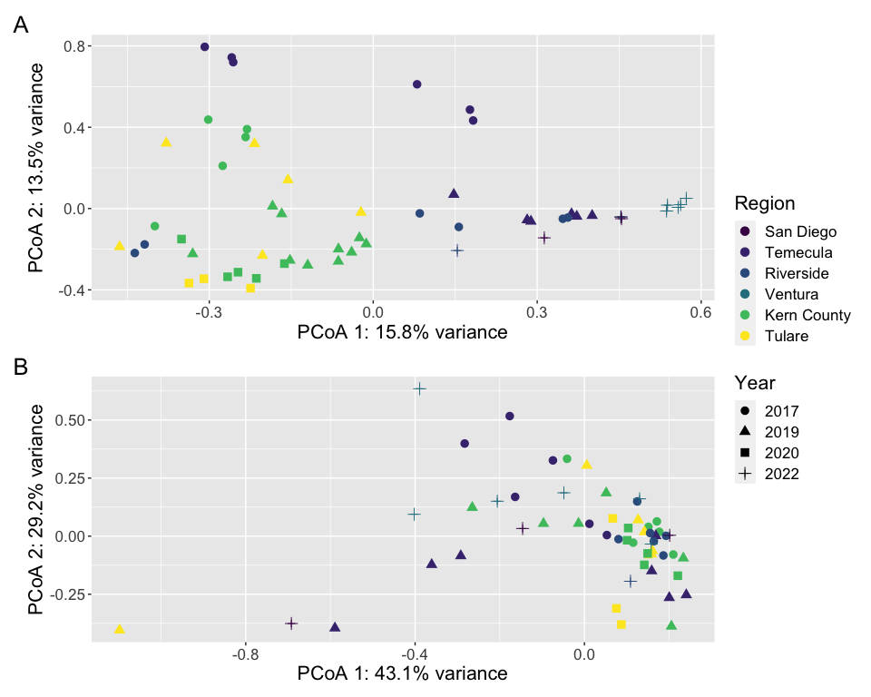<!-- -->

``` r
ggsave("../plots/beta_location.png", dpi = 300, device = "png",
    height = 8, width = 10, units = "in")
ggsave("../plots/beta_location.pdf", dpi = 300, device = "pdf",
    height = 8, width = 10, units = "in")
```

### Captivity (all GWSS)

``` r
# ITS
sample_data(ps.its_decontam_NC_wild.captive.sub)$Location.2 <- factor(sample_data(ps.its_decontam_NC_wild.captive.sub)$Location.2,
    levels = c("San Diego", "Temecula", "Riverside", "Ventura",
        "General Beale Kern County", "Edison Kern County", "Urban Site Kern County",
        "Tulare (RES)", "Tulare (SUS)", "Greenhouse Kern County RES",
        "Greenhouse Kern County SUS", "Greenhouse Riverside SUS",
        "Greenhouse Riverside G1"), labels = c("San Diego", "Temecula",
        "Riverside", "Ventura", "Kern County (General Beale)",
        "Kern County (Edison)", "Kern County (Urban Site)", "Tulare (RES)",
        "Tulare (SUS)", "Kern County (RES)", "Kern County (SUS)",
        "Riverside (SUS)", "Riverside (G1)"))


# Hellinger transformation of counts
plot.beta.its.cap = plot_ordination(physeq = ps.its_decontam_NC_wild.captive.sub,
    ordination = beta.its.cap[[1]], shape = "Wild.Captive", color = "Location.2") +
    geom_point(size = 3) + theme(text = element_text(size = 16)) +
    scale_colour_manual(values = c("#440154FF", "#46337EFF",
        "#365C8DFF", "#277F8EFF", "#1FA187FF", "#4AC16DFF", "#9FDA3AFF",
        "#FDE725FF", "#ffd14e", "#e69f00", "#ffa54e", "#ffb083",
        "#ffc1b5")) + labs(color = "Population", shape = "Captivity") +
    xlab(paste0("PCoA 1: ", round(100 * beta.its.cap[[1]]$values$Relative_eig[1],
        1), "% variance")) + ylab(paste0("PCoA 2: ", round(100 *
    beta.its.cap[[1]]$values$Relative_eig[2], 1), "% variance"))


# 16S

sample_data(ps.16s_decontam_NC_wild.captive.sub)$Location.2 <- factor(sample_data(ps.16s_decontam_NC_wild.captive.sub)$Location.2,
    levels = c("San Diego", "Temecula", "Riverside", "Ventura",
        "General Beale Kern County", "Edison Kern County", "Urban Site Kern County",
        "Tulare (RES)", "Tulare (SUS)", "Greenhouse Kern County RES",
        "Greenhouse Kern County SUS", "Greenhouse Riverside SUS",
        "Greenhouse Riverside G1"), labels = c("San Diego", "Temecula",
        "Riverside", "Ventura", "Kern County (General Beale)",
        "Kern County (Edison)", "Kern County (Urban Site)", "Tulare (RES)",
        "Tulare (SUS)", "Kern County (RES)", "Kern County (SUS)",
        "Riverside (SUS)", "Riverside (G1)"))


# Hellinger transformation of counts
plot.beta.16s.cap = plot_ordination(physeq = ps.16s_decontam_NC_wild.captive.sub,
    ordination = beta.16s.cap[[1]], shape = "Wild.Captive", color = "Location.2") +
    geom_point(size = 3) + theme(text = element_text(size = 16)) +
    scale_colour_manual(values = c("#440154FF", "#46337EFF",
        "#365C8DFF", "#277F8EFF", "#1FA187FF", "#4AC16DFF", "#9FDA3AFF",
        "#FDE725FF", "#ffd14e", "#e69f00", "#ffa54e", "#ffb083",
        "#ffc1b5")) + labs(color = "Population", shape = "Captivity") +
    xlab(paste0("PCoA 1: ", round(100 * beta.16s.cap[[1]]$values$Relative_eig[1],
        1), "% variance")) + ylab(paste0("PCoA 2: ", round(100 *
    beta.16s.cap[[1]]$values$Relative_eig[2], 1), "% variance"))


plot.beta.its.cap/plot.beta.16s.cap + plot_annotation(tag_levels = "A") +
    plot_layout(guides = "collect")
```

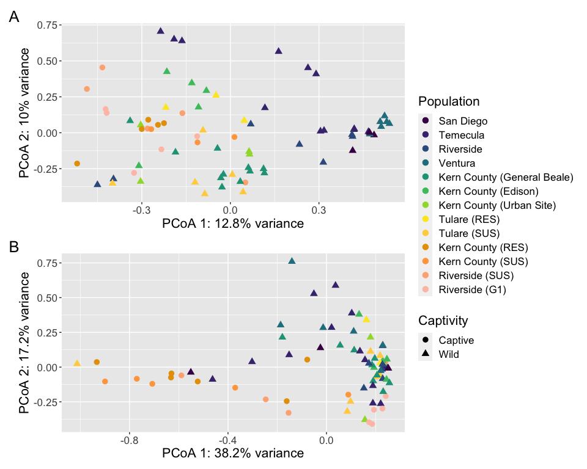<!-- -->

``` r
ggsave("../plots/beta_captive.png", dpi = 300, device = "png",
    height = 8, width = 10, units = "in")
ggsave("../plots/beta_captive.pdf", dpi = 300, device = "pdf",
    height = 8, width = 10, units = "in")
```

### Resistance (wild GWSS)

``` r
# ITS

# wild

# Hellinger transformation of counts
plot.beta.its.resW = plot_ordination(physeq = ps.its_decontam_NC_wild.res.sub,
    ordination = beta.its.resW[[1]], shape = "Rel.Res", color = "Rel.Res") +
    geom_point(size = 3) + theme(text = element_text(size = 14)) +
    scale_color_manual(values = c("#440154FF", "#FDE725FF")) +
    labs(color = "Resistance", shape = "Resistance") + xlab(paste0("PCoA 1: ",
    round(100 * beta.its.resW[[1]]$values$Relative_eig[1], 1),
    "% variance")) + ylab(paste0("PCoA 2: ", round(100 * beta.its.resW[[1]]$values$Relative_eig[2],
    1), "% variance"))


# 16S

# wild

# Hellinger transformation of counts
plot.beta.16s.resW = plot_ordination(physeq = ps.16s_decontam_NC_wild.res.sub,
    ordination = beta.16s.resW[[1]], shape = "Rel.Res", color = "Rel.Res") +
    geom_point(size = 3) + theme(text = element_text(size = 14)) +
    scale_color_manual(values = c("#440154FF", "#FDE725FF")) +
    labs(color = "Resistance", shape = "Resistance") + xlab(paste0("PCoA 1: ",
    round(100 * beta.16s.resW[[1]]$values$Relative_eig[1], 1),
    "% variance")) + ylab(paste0("PCoA 2: ", round(100 * beta.16s.resW[[1]]$values$Relative_eig[2],
    1), "% variance"))


(plot.beta.its.resW)/(plot.beta.16s.resW) + plot_annotation(tag_levels = "A") +
    plot_layout(guides = "collect")
```

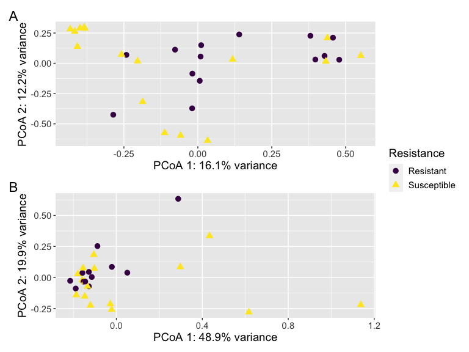<!-- -->

``` r
ggsave("../plots/beta_res.png", dpi = 300, device = "png", height = 6,
    width = 8, units = "in")
ggsave("../plots/beta_res.pdf", dpi = 300, device = "pdf", height = 6,
    width = 8, units = "in")
```

## Plotting Relative Abundance

Since RA not the main focus here, just want to give an idea of
composition and how there’s variation across locations and captivity,
will use stacked bars.

### Location x Captivity (all GWSS)

``` r
#ITS

ps.its.RA <- transform_sample_counts(ps.its_decontam_NC_wild.captive_rare,  function(x) x/sum(x))

ps.its.RA.gen <- tax_glom(ps.its.RA, taxrank="Genus", NArm=FALSE)

df_ps.its.RA.filt <- psmelt(ps.its.RA.gen)

grouped.its <- group_by(df_ps.its.RA.filt, Location.2, Wild.Captive, Phylum, Class, Order,Family,Genus)

avgs_grouped.its <- summarise(grouped.its, mean = 100 * mean(Abundance), 
                          sd = 100 * sd(Abundance), se = 100 * se(Abundance))
```

    ## `summarise()` has grouped output by 'Location.2', 'Wild.Captive', 'Phylum',
    ## 'Class', 'Order', 'Family'. You can override using the `.groups` argument.

``` r
avgs_grouped.its <- avgs_grouped.its %>%
  group_by(Genus) %>%
  mutate(Genus2 = ifelse(sum(mean) < 5, "Other", as.character(Genus))) %>%
  mutate(Genus2 = factor(Genus2, levels = c("Alternaria","Acremonium","Aureobasidium", "Chaetomium","Cladosporium","Fusarium","Golovinomyces","Metschnikowia", "Ramularia", "Neocosmospora", "Neodidymelliopsis", "Neosetophoma",  "Preussia","Basidiobolus", "Filobasidium", "Naganishia","Symmetrospora","Vishniacozyma", "Bifiguratus", "Unclassified", "Other"))) %>%
  mutate(Location.2 = factor(Location.2,levels = c("San Diego", "Temecula", "Riverside", "Ventura", "General Beale Kern County", "Edison Kern County", "Urban Site Kern County", "Tulare (RES)","Tulare (SUS)", "Greenhouse Kern County RES", "Greenhouse Kern County SUS", "Greenhouse Riverside SUS", "Greenhouse Riverside G1"), labels = c("San Diego", "Temecula", "Riverside", "Ventura", "Kern County (General Beale)", "Kern County (Edison)", "Kern County (Urban Site)", "Tulare (RES)","Tulare (SUS)", "Kern County (RES)", "Kern County (SUS)", "Riverside (SUS)", "Riverside (G1)")))
    

plot_s.its = ggplot(avgs_grouped.its, aes(x = Location.2, y = (mean),
    fill = Genus2)) + geom_bar(stat = "identity", position = "stack")

site_bar_ra.its <- plot_s.its + theme_bw() + theme(text = element_text(size = 14)) +
    ylab("Mean Relative Abundance") + xlab("") + guides(fill = guide_legend(title = "Genus"))   +
  theme(axis.text.x = element_text(angle = -55, hjust = 0, vjust = 0.5))+  facet_grid(~Wild.Captive, scales = "free", space="free") +
  scale_fill_manual(values = c(microshades_palette("micro_cvd_green", 4, lightest = FALSE), microshades_palette("micro_cvd_turquoise", 4), microshades_palette("micro_cvd_blue", 4, lightest = FALSE), microshades_palette("micro_cvd_orange", 1), microshades_palette("micro_cvd_purple", 4),microshades_palette("micro_cvd_orange", 1, lightest = FALSE), microshades_palette("micro_cvd_gray", 2, lightest = FALSE)))


# 16S

ps.16s.RA <- transform_sample_counts(ps.16s_decontam_NC_wild.captive_rare,  function(x) x/sum(x))

ps.16s.RA.gen <- tax_glom(ps.16s.RA, taxrank="Genus", NArm=FALSE)

df_ps.16s.RA.filt <- psmelt(ps.16s.RA.gen)

grouped.16s <- group_by(df_ps.16s.RA.filt, Location.2, Wild.Captive, Phylum, Class, Order,Family,Genus)

avgs_grouped.16s <- summarise(grouped.16s, mean = 100 * mean(Abundance), 
                          sd = 100 * sd(Abundance), se = 100 * se(Abundance))
```

    ## `summarise()` has grouped output by 'Location.2', 'Wild.Captive', 'Phylum',
    ## 'Class', 'Order', 'Family'. You can override using the `.groups` argument.

``` r
avgs_grouped.16s <- avgs_grouped.16s %>%
  mutate(Genus2 = ifelse(is.na(Genus), "Unknown", as.character(Genus))) %>%
  mutate(Genus2 = ifelse(Genus2 == "Unknown", paste0("Unclassified ", as.character(Family)), as.character(Genus2))) %>%
  group_by(Genus2) %>%
  mutate(Genus2 = ifelse(sum(mean) < 5, "Other", as.character(Genus2))) %>%
  mutate(Genus2 = factor(Genus2, levels=c("Candidatus Sulcia", "Azospirillum",  "Sphingomonas","Wolbachia",  "Acinetobacter","Candidatus Baumannia","Limnobacter", "Methylophilus", "Pseudomonas",  "Other"))) %>%
  mutate(Location.2 = factor(Location.2,levels = c("San Diego", "Temecula", "Riverside", "Ventura", "General Beale Kern County", "Edison Kern County", "Urban Site Kern County", "Tulare (RES)","Tulare (SUS)", "Greenhouse Kern County RES", "Greenhouse Kern County SUS", "Greenhouse Riverside SUS", "Greenhouse Riverside G1"), labels = c("San Diego", "Temecula", "Riverside", "Ventura", "Kern County (General Beale)", "Kern County (Edison)", "Kern County (Urban Site)", "Tulare (RES)","Tulare (SUS)", "Kern County (RES)", "Kern County (SUS)", "Riverside (SUS)", "Riverside (G1)")))
      


plot_s.16s = ggplot(avgs_grouped.16s, aes(x = Location.2, y = (mean),
    fill = Genus2)) + geom_bar(stat = "identity", position = "stack")

site_bar_ra.16s <- plot_s.16s + theme_bw() + theme(text = element_text(size = 14)) +
    ylab("Mean Relative Abundance") + xlab("") + guides(fill = guide_legend(title = "Genus"))     + #scale_fill_viridis_d(direction = -1, option = "H")  + 
  theme(axis.text.x = element_text(angle = -55, hjust = 0, vjust = 0.5)) +  facet_grid(~Wild.Captive, scales = "free", space="free") +
  scale_fill_manual(values = c(microshades_palette("micro_cvd_turquoise", 1, lightest = FALSE), microshades_palette("micro_cvd_purple", 3, lightest = FALSE), microshades_palette("micro_cvd_green", 5), microshades_palette("micro_cvd_gray", 1, lightest = FALSE)))


site_bar_ra.its / site_bar_ra.16s + plot_annotation(tag_levels = "A")
```

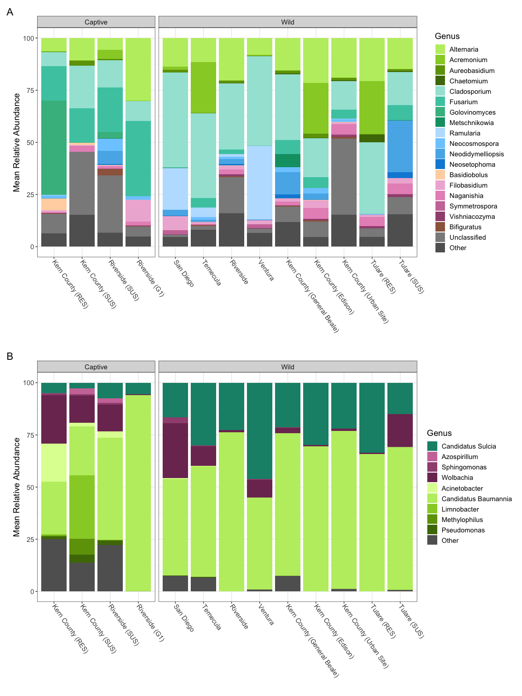<!-- -->

``` r
ggsave("../plots/relative.png", dpi=300, device = "png", height = 16, width= 12, units = "in")
ggsave("../plots/relative.pdf", dpi=300, device = "pdf", height = 16, width= 12, units = "in")
```

## DESeq2

### Fun-Guild

# Assigning predicted functional guilds

``` r
# ITS

otu <- as.data.frame(t(otu_table(ps.its_decontam_NC_wild.captive)))
tax <- as.data.frame(tax_table(ps.its_decontam_NC_wild.captive))
otu$OTU_ID <- row.names(otu)

tax <- tax %>%
    mutate(Kingdom = str_replace(Kingdom, "k__", "")) %>%
    mutate(taxonomy = paste0(Kingdom, ";", Phylum, ";", Class,
        ";", Order, ";", Family, ";", Genus, ";", Species))

tax$OTU_ID <- rownames(tax)

tax <- subset(tax, select = -c(Kingdom, Phylum, Class, Order,
    Family, Genus, Species))

otu.v2 <- full_join(otu, tax)
```

    ## Joining with `by = join_by(OTU_ID)`

``` r
row.names(otu.v2) <- otu.v2$OTU_ID
otu.v2 <- subset(otu.v2, select = -c(OTU_ID))

# double check headers (and fix if needed) see
# https://github.com/UMNFuN/FUNGuild write.table(otu.v2,
# '../results/ITS/processed_data/fungalasvs4funguild.txt',
# sep = '\t', quote = FALSE)

# in terminal run python3.7 ../../../scripts/Guilds_v1.1.py
# -otu fungalasvs4funguild.txt -db fungi -m -u

# manual suggests only accepting guild assignments that are
# probable or highly probable works at a 'genus' level of
# classification

guilds <- read_delim("../results/ITS/processed_data/fungalasvs4funguild.guilds.txt")
```

    ## Rows: 1812 Columns: 97
    ## ── Column specification ────────────────────────────────────────────────────────
    ## Delimiter: "\t"
    ## chr (11): OTU_ID, taxonomy, Taxon, Taxon Level, Trophic Mode, Guild, Growth ...
    ## dbl (86): GW001, GW002, GW003, GW004, GW005, GW006, GW009, GW010, GW011, GW0...
    ## 
    ## ℹ Use `spec()` to retrieve the full column specification for this data.
    ## ℹ Specify the column types or set `show_col_types = FALSE` to quiet this message.

``` r
guilds <- guilds[-c(2:88)]
```

## Captivity

``` r
# ITS

deseq.ps.its <- phyloseq_to_deseq2(ps.its_decontam_NC_wild.captive,
    ~Wild.Captive + Loc.Abbr + Year)
```

    ## Warning in DESeqDataSet(se, design = design, ignoreRank): some variables in
    ## design formula are characters, converting to factors

``` r
# adding pseudocount
gm_mean = function(x, na.rm = TRUE) {
    exp(sum(log(x[x > 0]), na.rm = na.rm)/length(x))
}

geoMeans = apply(counts(deseq.ps.its), 1, gm_mean)

deseq.ps.its.v2 = estimateSizeFactors(deseq.ps.its, geoMeans = geoMeans)

# filter out low abundance asvs
keep <- rowSums(counts(deseq.ps.its.v2)) >= 10
dds.ps.its <- deseq.ps.its.v2[keep, ]

dds.its = DESeq(dds.ps.its, test = "Wald", fitType = "parametric")

resultsNames(dds.its)
```

    ## [1] "Intercept"                         "Wild.Captive_Wild_vs_Captive"     
    ## [3] "Loc.Abbr_Riverside_vs_Kern.County" "Loc.Abbr_San.Diego_vs_Kern.County"
    ## [5] "Loc.Abbr_Temecula_vs_Kern.County"  "Loc.Abbr_Tulare_vs_Kern.County"   
    ## [7] "Loc.Abbr_Ventura_vs_Kern.County"   "Year"

``` r
alpha = 0.05

res.its <- results(dds.its, contrast = c("Wild.Captive", "Captive",
    "Wild"), pAdjustMethod = "bonferroni")

# filter results by p-value
res.its.alpha <- res.its[which(res.its$padj < alpha), ]

# Bind taxonomy to results
res.alpha.its.tax = cbind(as(res.its.alpha, "data.frame"), as(tax_table(ps.its_decontam_NC_wild.captive)[rownames(res.its.alpha),
    ], "matrix"))

res.alpha.its.tax$ASV <- row.names(res.alpha.its.tax)


res.alpha.its.tax <- res.alpha.its.tax %>%
    mutate(Genus = ifelse(Genus == "Unclassified", ifelse(Family ==
        "Unclassified", ifelse(Order == "Unclassified", ifelse(Class ==
        "Unclassified", ifelse(Phylum == "Unclassified", "Unclassified Fungi",
        paste0("Unclassified ", as.character(Phylum))), paste0("Unclassified ",
        as.character(Class))), paste0("Unclassified ", as.character(Order))),
        paste0("Unclassified ", as.character(Family))), as.character(Genus))) %>%
    mutate(ASV = paste0(as.character(Genus), " (", ASV, ")")) %>%
    mutate(ASV = fct_reorder(ASV, log2FoldChange))

res.alpha.its.tax$OTU_ID <- rownames(res.alpha.its.tax)
res.alpha.its.tax <- left_join(res.alpha.its.tax, guilds) %>%
    mutate(`Trophic Mode` = ifelse(`Trophic Mode` == "-", "Unclassified",
        as.character(`Trophic Mode`)))

write.csv(res.alpha.its.tax, "../results/ITS/deseq.captivity.csv")

# 16S

deseq.ps.16s <- phyloseq_to_deseq2(ps.16s_decontam_NC_wild.captive,
    ~Wild.Captive + Loc.Abbr + Year)
```

    ## Warning in DESeqDataSet(se, design = design, ignoreRank): some variables in
    ## design formula are characters, converting to factors

``` r
# adding pseudocount
geoMeans = apply(counts(deseq.ps.16s), 1, gm_mean)

deseq.ps.16s.v2 = estimateSizeFactors(deseq.ps.16s, geoMeans = geoMeans)

# filter out low abundance asvs
keep <- rowSums(counts(deseq.ps.16s.v2)) >= 10
dds.ps.16s <- deseq.ps.16s.v2[keep, ]

dds.16s = DESeq(dds.ps.16s, test = "Wald", fitType = "parametric")

resultsNames(dds.16s)
```

    ## [1] "Intercept"                         "Wild.Captive_Wild_vs_Captive"     
    ## [3] "Loc.Abbr_Riverside_vs_Kern.County" "Loc.Abbr_San.Diego_vs_Kern.County"
    ## [5] "Loc.Abbr_Temecula_vs_Kern.County"  "Loc.Abbr_Tulare_vs_Kern.County"   
    ## [7] "Loc.Abbr_Ventura_vs_Kern.County"   "Year"

``` r
alpha = 0.05

res.16s <- results(dds.16s, contrast = c("Wild.Captive", "Captive",
    "Wild"), pAdjustMethod = "bonferroni")

# filter results by p-value
res.16s.alpha <- res.16s[which(res.16s$padj < alpha), ]

# Bind taxonomy to results
res.16s.alpha.tax = cbind(as(res.16s.alpha, "data.frame"), as(tax_table(ps.16s_decontam_NC_wild.res)[rownames(res.16s.alpha),
    ], "matrix"))

res.16s.alpha.tax$ASV <- row.names(res.16s.alpha.tax)

res.16s.alpha.tax <- res.16s.alpha.tax %>%
    mutate(Genus = ifelse(is.na(Genus), ifelse(is.na(Family),
        ifelse(is.na(Order), ifelse(is.na(Class), ifelse(is.na(Phylum),
            "Unclassified Bacteria", paste0("Unclassified ",
                as.character(Phylum))), paste0("Unclassified ",
            as.character(Class))), paste0("Unclassified ", as.character(Order))),
        paste0("Unclassified ", as.character(Family))), as.character(Genus))) %>%
    mutate(ASV = paste0(as.character(Genus), " (", ASV, ")")) %>%
    mutate(ASV = fct_reorder(ASV, log2FoldChange))

write.csv(res.16s.alpha.tax, "../results/16S/deseq.captivity.csv")


# going to use same max values for ITS and 16S plots
# generate plot of significant ASVs for each contrast Genus
p.its <- ggplot(res.alpha.its.tax, aes(x = ASV, y = log2FoldChange,
    color = log2FoldChange, shape = `Trophic Mode`)) + geom_point(size = 6) +
    theme(axis.text.x = element_text(angle = -70, hjust = 0,
        vjust = 0.5), plot.title = element_text(hjust = 0.5)) +
    ylab(expression(paste("lo", g[2], " fold change"))) + scale_shape_manual(values = c(8,
    17, 15, 10, 16)) + coord_flip() + theme_minimal() + geom_hline(yintercept = 0,
    linetype = "solid", color = "red") + scale_color_gradientn(limits = c(-max(abs(res.alpha.its.tax$log2FoldChange),
    abs(res.16s.alpha.tax$log2FoldChange)), max(abs(res.alpha.its.tax$log2FoldChange),
    abs(res.16s.alpha.tax$log2FoldChange))), colors = rev(brewer.pal(11,
    "RdBu"))) + labs(color = expression(paste("lo", g[2], " fold change")))


# generate plot of significant ASVs for each contrast Genus
p.16s <- ggplot(res.16s.alpha.tax, aes(x = ASV, y = log2FoldChange,
    color = log2FoldChange)) + geom_point(size = 6) + theme(axis.text.x = element_text(angle = -70,
    hjust = 0, vjust = 0.5), plot.title = element_text(hjust = 0.5)) +
    ylab(expression(paste("lo", g[2], " fold change"))) + coord_flip() +
    theme_minimal() + geom_hline(yintercept = 0, linetype = "solid",
    color = "red") + scale_color_gradientn(limits = c(-max(abs(res.alpha.its.tax$log2FoldChange),
    abs(res.16s.alpha.tax$log2FoldChange)), max(abs(res.alpha.its.tax$log2FoldChange),
    abs(res.16s.alpha.tax$log2FoldChange))), colors = rev(brewer.pal(11,
    "RdBu"))) + labs(color = expression(paste("lo", g[2], " fold change")))


guide_area() + p.its + p.16s + plot_annotation(tag_levels = "A") +
    plot_layout(guides = "collect")
```

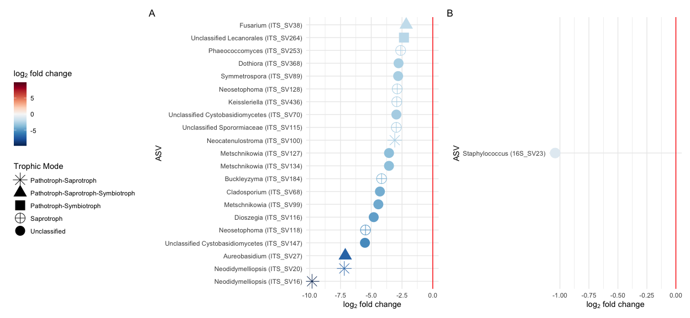<!-- -->

``` r
ggsave("../plots/deg_captive.png", dpi = 300, device = "png",
    height = 6, width = 13, units = "in")
ggsave("../plots/deg_captive.pdf", dpi = 300, device = "pdf",
    height = 6, width = 13, units = "in")
```

## Resistance

``` r
# ITS

# Wild
ps.its_decontam_NC_wild.res@sam_data$Year = factor(ps.its_decontam_NC_wild.res@sam_data$Year)

deseq.ps.its.WR <- phyloseq_to_deseq2(ps.its_decontam_NC_wild.res,
    ~Loc.Abbr + Year + Rel.Res)
```

    ## Warning in DESeqDataSet(se, design = design, ignoreRank): some variables in
    ## design formula are characters, converting to factors

``` r
# adding pseudocount
geoMeans = apply(counts(deseq.ps.its.WR), 1, gm_mean)

deseq.ps.its.WR.v2 = estimateSizeFactors(deseq.ps.its.WR, geoMeans = geoMeans)

# filter out low abundance asvs
keep <- rowSums(counts(deseq.ps.its.WR.v2)) >= 10
dds.ps.its.WR <- deseq.ps.its.WR.v2[keep, ]

dds.its.WR = DESeq(dds.ps.its.WR, test = "Wald", fitType = "parametric")

resultsNames(dds.its.WR)
```

    ## [1] "Intercept"                        "Loc.Abbr_Temecula_vs_Kern.County"
    ## [3] "Loc.Abbr_Tulare_vs_Kern.County"   "Year_2020_vs_2019"               
    ## [5] "Rel.Res_Susceptible_vs_Resistant"

``` r
alpha = 0.05

res.its.WR <- results(dds.its.WR, contrast = c("Rel.Res", "Resistant",
    "Susceptible"), pAdjustMethod = "bonferroni")

# filter results by p-value
res.its.WR.alpha <- res.its.WR[which(res.its.WR$padj < alpha),
    ]

# Bind taxonomy to results
res.its.WR.alpha.tax = cbind(as(res.its.WR.alpha, "data.frame"),
    as(tax_table(ps.its_decontam_NC_wild.res)[rownames(res.its.WR.alpha),
        ], "matrix"))

res.its.WR.alpha.tax$ASV <- row.names(res.its.WR.alpha.tax)

res.its.WR.alpha.tax <- res.its.WR.alpha.tax %>%
    mutate(Genus = ifelse(Genus == "Unclassified", ifelse(Family ==
        "Unclassified", ifelse(Order == "Unclassified", ifelse(Class ==
        "Unclassified", ifelse(Phylum == "Unclassified", "Unclassified Fungi",
        paste0("Unclassified ", as.character(Phylum))), paste0("Unclassified ",
        as.character(Class))), paste0("Unclassified ", as.character(Order))),
        paste0("Unclassified ", as.character(Family))), as.character(Genus))) %>%
    mutate(ASV = paste0(as.character(Genus), " (", ASV, ")")) %>%
    mutate(ASV = fct_reorder(ASV, log2FoldChange))

res.its.WR.alpha.tax$OTU_ID <- rownames(res.its.WR.alpha.tax)
res.its.WR.alpha.tax <- left_join(res.its.WR.alpha.tax, guilds) %>%
    mutate(`Trophic Mode` = ifelse(`Trophic Mode` == "-", "Unclassified",
        as.character(`Trophic Mode`)))

write.csv(res.its.WR.alpha.tax, "../results/ITS/deseq.res.csv")


# 16S

# Wild
ps.16s_decontam_NC_wild.res@sam_data$Year <- factor(ps.16s_decontam_NC_wild.res@sam_data$Year)

deseq.ps.16s.WR <- phyloseq_to_deseq2(ps.16s_decontam_NC_wild.res,
    ~Loc.Abbr + Year + Rel.Res)
```

    ## Warning in DESeqDataSet(se, design = design, ignoreRank): some variables in
    ## design formula are characters, converting to factors

``` r
# adding pseudocount
geoMeans = apply(counts(deseq.ps.16s.WR), 1, gm_mean)

deseq.ps.16s.WR.v2 = estimateSizeFactors(deseq.ps.16s.WR, geoMeans = geoMeans)

# filter out low abundance asvs
keep <- rowSums(counts(deseq.ps.16s.WR.v2)) >= 10
dds.ps.16s.WR <- deseq.ps.16s.WR.v2[keep, ]

dds.16s.WR = DESeq(dds.ps.16s.WR, test = "Wald", fitType = "parametric")

resultsNames(dds.16s.WR)
```

    ## [1] "Intercept"                        "Loc.Abbr_Temecula_vs_Kern.County"
    ## [3] "Loc.Abbr_Tulare_vs_Kern.County"   "Year_2020_vs_2019"               
    ## [5] "Rel.Res_Susceptible_vs_Resistant"

``` r
alpha = 0.05

res.16s.WR <- results(dds.16s.WR, contrast = c("Rel.Res", "Resistant",
    "Susceptible"), pAdjustMethod = "bonferroni")

# filter results by p-value
res.16s.WR.alpha <- res.16s.WR[which(res.16s.WR$padj < alpha),
    ]

# Bind taxonomy to results
res.16s.WR.alpha.tax = cbind(as(res.16s.WR.alpha, "data.frame"),
    as(tax_table(ps.16s_decontam_NC_wild.res)[rownames(res.16s.WR.alpha),
        ], "matrix"))

res.16s.WR.alpha.tax$ASV <- row.names(res.16s.WR.alpha.tax)

res.16s.WR.alpha.tax <- res.16s.WR.alpha.tax %>%
    mutate(Genus = ifelse(is.na(Genus), ifelse(is.na(Family),
        ifelse(is.na(Order), ifelse(is.na(Class), ifelse(is.na(Phylum),
            "Unclassified Bacteria", paste0("Unclassified ",
                as.character(Phylum))), paste0("Unclassified ",
            as.character(Class))), paste0("Unclassified ", as.character(Order))),
        paste0("Unclassified ", as.character(Family))), as.character(Genus))) %>%
    mutate(ASV = paste0(as.character(Genus), " (", ASV, ")")) %>%
    mutate(ASV = fct_reorder(ASV, log2FoldChange))

write.csv(res.16s.WR.alpha.tax, "../results/16S/deseq.res.csv")

# using same maximum values for the log2fold changes in the
# plots generate plot of significant ASVs for each contrast
# Genus
p.res.its <- ggplot(res.its.WR.alpha.tax, aes(x = ASV, y = log2FoldChange,
    color = log2FoldChange, shape = `Trophic Mode`)) + geom_point(size = 6) +
    theme(axis.text.x = element_text(angle = -70, hjust = 0,
        vjust = 0.5), plot.title = element_text(hjust = 0.5)) +
    ylab(expression(paste("lo", g[2], " fold change"))) + scale_shape_manual(values = c(8,
    17, 10, 16)) + coord_flip() + theme_minimal() + geom_hline(yintercept = 0,
    linetype = "solid", color = "red") + scale_color_gradientn(limits = c(-max(abs(res.its.WR.alpha.tax$log2FoldChange),
    abs(res.16s.WR.alpha.tax$log2FoldChange)), max(abs(res.its.WR.alpha.tax$log2FoldChange),
    abs(res.16s.WR.alpha.tax$log2FoldChange))), colors = rev(brewer.pal(11,
    "RdBu"))) + labs(color = expression(paste("lo", g[2], " fold change")))

# generate plot of significant ASVs for each contrast Genus
p.res.16s <- ggplot(res.16s.WR.alpha.tax, aes(x = ASV, y = log2FoldChange,
    color = log2FoldChange)) + geom_point(size = 6) + theme(axis.text.x = element_text(angle = -70,
    hjust = 0, vjust = 0.5), plot.title = element_text(hjust = 0.5)) +
    ylab(expression(paste("lo", g[2], " fold change"))) + coord_flip() +
    theme_minimal() + geom_hline(yintercept = 0, linetype = "solid",
    color = "red") + scale_color_gradientn(limits = c(-max(abs(res.16s.WR.alpha.tax$log2FoldChange),
    abs(res.its.WR.alpha.tax$log2FoldChange)), max(abs(res.16s.WR.alpha.tax$log2FoldChange),
    abs(res.its.WR.alpha.tax$log2FoldChange))), colors = rev(brewer.pal(11,
    "RdBu"))) + labs(color = expression(paste("lo", g[2], " fold change")))


guide_area() + p.res.its + p.res.16s + plot_annotation(tag_levels = "A") +
    plot_layout(guides = "collect")
```

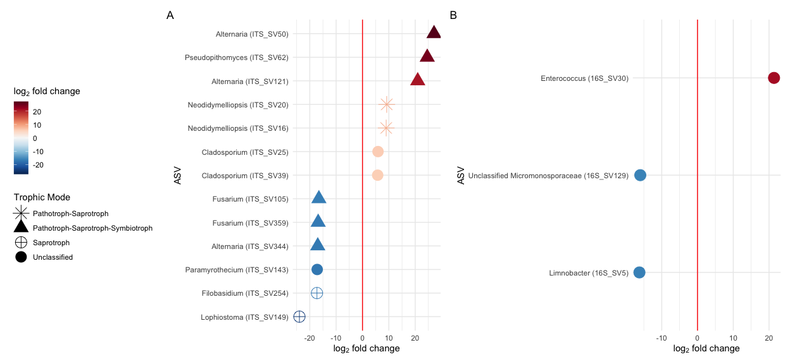<!-- -->

``` r
ggsave("../plots/deg_res.png", dpi = 300, device = "png", height = 6,
    width = 13, units = "in")
ggsave("../plots/deg_res.pdf", dpi = 300, device = "pdf", height = 6,
    width = 13, units = "in")
```

## Map

``` r
california <- map_data("county", region = "California")

sites.info <- read.csv("../data/gwss_sites.csv")

sites.info.avg <- sites.info %>%
    select(-Status) %>%
    mutate(Location = ifelse(Location %in% c("Edison Kern County",
        "General Beale Kern County", "Urban Site Kern County"),
        "Kern County", as.character(Location))) %>%
    group_by(Location) %>%
    summarize(LatMean = mean(lat), LongMean = mean(long)) %>%
    mutate(Location = factor(Location, levels = c("San Diego",
        "Temecula", "Riverside", "Ventura", "Kern County", "Tulare")))


cali_map <- ggplot() + geom_polygon(data = california, aes(x = long,
    y = lat, group = group), fill = "grey", alpha = 0.3) + theme(panel.background = element_blank(),
    panel.border = element_blank(), panel.grid.major = element_blank(),
    panel.grid.minor = element_blank(), legend.key = element_rect(fill = NA,
        color = NA), axis.text.y = element_blank(), axis.text.x = element_blank(),
    axis.title.x = element_blank(), axis.ticks.y = element_blank(),
    axis.ticks.x = element_blank(), axis.title.y = element_blank()) +
    geom_label(data = sites.info.avg, aes(x = LongMean, y = LatMean,
        label = Location, fill = Location), hjust = 0, nudge_x = 0.1,
        colour = "white", fontface = "bold") + scale_fill_manual(values = c("#440154FF",
    "#46337EFF", "#365C8DFF", "#277F8EFF", "#4AC16DFF", "#FDE725FF")) +
    theme(legend.position = "none")

ggsave("../plots/map.png", dpi = 300, device = "png", height = 6,
    width = 6, units = "in")
ggsave("../plots/map.pdf", dpi = 300, device = "pdf", height = 6,
    width = 6, units = "in")
```
